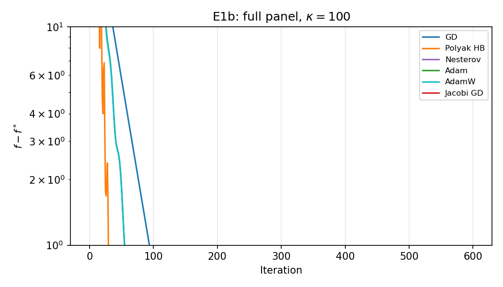

# 答辩一页备忘（可直接做成 PPT）

**题目**：经典迭代法与现代优化器的统一数值分析  
**成员**：赵泽霖（2023010848）、史云天（2023010836）

---

## 核心信息（30 秒）

统一模板 $x_{k+1}=x_k-P_k g_k$：GD = Richardson；Momentum/Nesterov = 谱加速；Adam = 动态 Jacobi；Muon = Newton–Schulz 正交化。

---

## 图 1：机制 — 各优化器收敛（κ=100）

**一句话**：不同 $P_k$ 决定收敛速度；Momentum/Nesterov 明显快于 GD，Adam 前期慢、后期可高精度。

---

## 图 2：理论 — 经验 ρ 贴合谱半径

**一句话**：$\log(f-f^*)$ 斜率与理论 $\rho^*=(\sqrt\kappa-1)/(\sqrt\kappa+1)$ 平行，谱分析在二次模型上可验证。

---

## 图 3：几何 — Muon 与 Frobenius 二次

**一句话**：Muon-NS 更新面向谱范数/trust-region 几何，**不保证** Frobenius 矩阵二次损失单调下降（非 bug）。

---

## 预备追问（附录）

| 问题 | 答 |
|------|-----|
| Adam κ=1000 未收敛？ | 对角预条件 + lr 敏感（E13） |
| κ_eff > κ(A)？ | 早期预条件未稳定 |
| 为何不做 NN？ | 聚焦可控二次模型 + E14 噪声 |
| PCG 更快？ | Krylov 最优 vs 一阶实用（E17） |

---

*图片路径相对于本文件；导出 PPT 时请从 `figures/` 插入同名 PNG。*
