# 经典迭代法与现代优化器的统一数值分析

**课程**：数值分析  
**选题**：从经典迭代法到现代优化器的统一数值分析（选题 2）  
**成员**：赵泽霖（2023010848）、史云天（2023010836）  
**日期**：2026 年 5 月

---

## 摘要

本文将梯度下降（GD）、动量法（Momentum）、Nesterov 加速、Adam/AdamW、Sophia（简化）与 Muon 中的 Newton–Schulz 正交化统一为数值迭代模板 $x_{k+1}=x_k-P_k g_k$。我们从强凸二次模型出发，给出 GD 线性收敛的完整证明（附录 C），并在二次函数上分析 Heavy-ball / Nesterov 的谱加速率、Adam 的动态 Jacobi 预条件及 Newton–Schulz 的局部二次收敛。**Muon 的核心是 Newton–Schulz 正交化**；实验 E12 在 Frobenius 矩阵二次上演示其更新**几何**，而非该目标下的最速下降。数值实验覆盖 $\kappa\in\{10,100,1000\}$ 及 $\kappa$ 连续扫描、特征模态衰减、Adam 学习率与 $(\beta_1,\beta_2)$ 消融、带噪 SGD 与 PCG 基线等。

---

## 1 引言

深度学习中的 Adam、Muon 等优化器通常被视为“黑箱调参工具”。本项目的出发点是：**将它们重新理解为数值分析中的迭代法**，与课本中的 Richardson 迭代、Jacobi 预条件、Newton 型矩阵迭代建立对应关系。

核心统一模板为

$$
x_{k+1} = x_k - P_k g_k, \qquad g_k = \nabla f(x_k),
$$

其中 $P_k$ 为（可能随迭代变化的）预条件矩阵。不同优化器对应不同的 $P_k$ 构造方式（见表 1）。

| 方法 | $P_k$ | 数值分析对应 |
|------|--------|----------------|
| GD | $\eta I$ | Richardson / 梯度流 Euler 离散 |
| Momentum | $\eta I$（作用于累积梯度） | 二阶 ODE 离散、谱加速 |
| Adam | $\eta\,\mathrm{diag}(\hat v_k)^{-1/2}$ | 动态 Jacobi 预条件 |
| Muon（矩阵参数） | Newton–Schulz 正交化 $G$ | 极分解 / 谱范数 trust-region |

本文不做神经网络训练实验，而聚焦**可控的二次模型**与**矩阵迭代**，以便与理论谱分析一一对照。

---

## 2 统一框架与问题设定

### 2.1 目标函数

考虑强凸二次问题

$$
\min_{x\in\mathbb{R}^d} f(x)=\frac12 x^\top A x - b^\top x,
\qquad A=A^\top\succ 0,
$$

其唯一极小点为 $x^\*=A^{-1}b$，梯度 $g(x)=Ax-b$。记 $\mu=\lambda_{\min}(A)$、$L=\lambda_{\max}(A)$、$\kappa=L/\mu$。

实验中用随机正交矩阵构造 $A=Q\mathrm{diag}(\mu,\ldots,L)Q^\top$，保证 $\kappa(A)$ 精确可控（见 `src/quadratic.py`）。

### 2.2 与线性方程组迭代的联系

一阶最优性条件 $Ax^\*=b$ 等价于**求解对称正定线性系统**。GD 步

$$
x_{k+1}=x_k-\eta(Ax_k-b)
$$

正是对 $Ax=b$ 的 **Richardson 迭代** $x_{k+1}=x_k-\eta(Ax_k-b)$，预条件矩阵 $P_k=\eta I$。

---

## 3 理论推导

### 3.1 梯度下降：Lipschitz 梯度与线性收敛

**定理 1（GD 在强凸二次上的线性收敛）**  
设 $f$ 为 $\mu$-强凸且梯度 $L$-Lipschitz 连续。取步长 $\eta\in(0,2/L)$，则 GD 满足

$$
\|x_{k+1}-x^\*\|\le \rho\,\|x_k-x^\*\|,\qquad
\rho=\max\{|1-\eta\mu|,\,|1-\eta L|\}.
$$

**证明概要.** 递推 $e_{k+1}=(I-\eta A)e_k$；在 $A$ 的特征基下各模态以 $|1-\eta\lambda_i|$ 衰减。最优步长 $\eta^\*=2/(\mu+L)$ 给出 $\rho^\*=(\kappa-1)/(\kappa+1)$。**完整证明见附录 C。**

**推论（与 Richardson 迭代）**  
谱半径 $\rho(I-\eta A)=\max_i|1-\eta\lambda_i|$ 即迭代矩阵的谱半径；条件数越大，$\rho^\*$ 越接近 1，收敛越慢。

---

### 3.2 动量法：Heavy-ball 与谱半径

Polyak 动量（Heavy-ball）为

$$
\begin{aligned}
v_{k+1} &= \beta v_k + g_k,\\
x_{k+1} &= x_k - \eta v_{k+1}.
\end{aligned}
$$

在二次 $f(x)=\frac12(\lambda x^2)$（标量）上，可写成二阶递推，等价于 $2\times 2$ 迭代矩阵 $T(\lambda)$ 作用于 $[x_k;x_{k-1}]$（见 `src/momentum_spectrum.py`）。

**定理 2（Polyak 最优参数）**  
对 $\mu$-强凸、$L$-光滑的二次函数，取

$$
\eta^\*=\frac{4}{(\sqrt L+\sqrt\mu)^2},\qquad
\beta^\*=\left(\frac{\sqrt L-\sqrt\mu}{\sqrt L+\sqrt\mu}\right)^2,
$$

则最坏模态的谱半径为

$$
\rho^\*_{\mathrm{HB}}=\frac{\sqrt\kappa-1}{\sqrt\kappa+1},
$$

优于 GD 的 $(\kappa-1)/(\kappa+1)$。例如 $\kappa=100$ 时，$\rho^\*_{\mathrm{HB}}\approx 0.818$，$\rho^\*_{\mathrm{GD}}\approx 0.980$（实验 2 验证）。

**证明思路（概要）**  
在特征方向 $\lambda\in\{\mu,L\}$ 上，迭代矩阵为

$$
T(\lambda)=\begin{bmatrix}
1-\eta\lambda+\beta & -\beta\\
1 & 0
\end{bmatrix}.
$$

Polyak 选取 $\eta,\beta$ 使 $\mu$ 与 $L$ 两个模态达到**等谱半径**（切比雪夫型最优）。直接计算特征值可验证 $\rho(T(\mu))=\rho(T(L))=(\sqrt\kappa-1)/(\sqrt\kappa+1)$。完整代数展开见 Polyak (1964) 或 Saad 第 9 章。$\square$

**与 ODE 的对应**  
连续时间模型 $\ddot x+\gamma \dot x+\nabla f(x)=0$ 在 $f$ 为二次时化为阻尼谐振子。Su et al. (2016) 证明 Nesterov 加速的连续极限满足 $X''+(3/t)X'+\nabla f(X)=0$，与 Heavy-ball 的 $\ddot x+\beta\dot x+\nabla f=0$ 属不同离散化。**实验 E11** 显示：在二次模型上二者采用同阶加速参数时收敛率接近 $(\sqrt\kappa-1)/(\sqrt\kappa+1)$，差异主要体现在实现（在 $y_k$ 处取梯度 vs 累积动量）。

---

### 3.3 Adam：动态 Jacobi 预条件

Adam 更新（对角情形）为

$$
\begin{aligned}
m_k &= \beta_1 m_{k-1}+(1-\beta_1)g_k,\\
v_k &= \beta_2 v_{k-1}+(1-\beta_2)g_k\odot g_k,\\
x_{k+1} &= x_k - \eta\,\hat m_k \oslash (\sqrt{\hat v_k}+\varepsilon),
\end{aligned}
$$

其中 $\hat m_k,\hat v_k$ 为偏差校正量。

**命题 3（Adam 作为动态 Jacobi 预条件）**  
忽略动量（$\beta_1=0$）且 $v_k$ 已稳定时，Adam 步近似

$$
x_{k+1}\approx x_k - \eta\,\mathrm{diag}(g_k\oslash g_k)^{-1/2} g_k
= x_k - P_k g_k,\quad P_k=\eta\,\mathrm{diag}(|g_k|)^{-1}.
$$

对二次问题 $g_k=(A x_k-b)$ 的分量，在坐标 $i$ 上预条件尺度约为 $1/|g_{k,i}|$，使各坐标方向上的有效步长趋于均衡——这与** Jacobi 预条件** $P^{-1}\approx \mathrm{diag}(A)^{-1}$ 的思想一致，区别在于 Adam 用梯度历史估计对角尺度，因而 $P_k$ **随迭代变化**。

**有效条件数**  
定义 $\kappa_{\mathrm{eff}}(k)=\kappa(P_k^{-1}A)$。若 $P_k$ 良好逼近 $A^{-1}$ 的尺度，则 $\kappa_{\mathrm{eff}}\ll\kappa(A)$。实验 4 绘制 $\kappa_{\mathrm{eff}}(k)$ 的演化；在 $\kappa=100$ 的二次问题上，Adam 在中后期可将有效条件数从 $100$ 降至约 $10^1$ 量级（但仍可能因 $\beta_1,\beta_2$ 偏差校正而波动）。

**对照：固定 Jacobi 预条件**  
取 $P=\mathrm{diag}(A)^{-1}$，则预条件后矩阵 $P^{-1}A$ 满足

$$
(P^{-1}A)_{ii}=1,\qquad (P^{-1}A)_{ij}=\frac{A_{ij}}{A_{jj}}\quad(i\ne j).
$$

当 $A$ 为对角阵时，$P^{-1}A=I$，一次迭代即可精确求解（实验 8 下行：$\kappa_{\mathrm{eff}}\to 1$）；当 $A$ 为稠密旋转矩阵时，$\kappa(P^{-1}A)$ 仍可能很大（实验 8 上行）。因此 Adam 可视为在**未知 $A$** 时用 $g_k\odot g_k$ 的滑动平均在线估计 $\mathrm{diag}(A)$ 的尺度。

**AdamW（解耦权重衰减）**  
AdamW 将 $L_2$ 正则从梯度中解耦：$x_{k+1}=x_k-\eta\bigl(\hat m_k\oslash(\sqrt{\hat v_k}+\varepsilon)+\lambda x_k\bigr)$。此时**自适应预条件仍主要由 $\mathrm{diag}(\hat v_k)^{-1/2}$ 给出**，权重衰减 $\lambda x_k$ 为与 $P_k$ 无关的额外收缩，不改变「动态 Jacobi」对梯度尺度的解释，但会改变不动点（实验 `exp1b` 中 AdamW 曲线与 Adam 略分离）。

---

### 3.4 Newton–Schulz 迭代与 Muon

Muon 优化器对矩阵形梯度 $G\in\mathbb{R}^{m\times n}$ 施加**谱范数约束**下的更新，核心子程序为 Newton–Schulz 迭代求正交极因子：

$$
X_{k+1}=\frac12 X_k\bigl(3I-X_k^\top X_k\bigr),\quad X_0\approx G/\|G\|_2.
$$

**定理 4（局部二次收敛）**  
若 $X_k$ 充分接近某半正交矩阵（奇异值均在 $(0,\sqrt3)$ 内），且 $X_k$ 满列秩，则 Newton–Schulz 迭代对 $X^\top X\to I$ **二次收敛**。

**证明思路.** 令 $E_k=X_k^\top X_k-I$，可递推得 $\|E_{k+1}\|=O(\|E_k\|^2)$（见 Higham, *Functions of Matrices*）。实验 3 显示 $\|X_k^\top X_k-I\|_F$ 呈阶梯式下降，典型 10–15 步达 $10^{-6}$ 以下。

**与 Muon 的联系**  
矩阵梯度 $G$ 的极分解 $G=U\Sigma V^\top$ 中，$UV^\top$ 为 Stiefel 流形上的正交因子。Kovalev (2025) 将梯度正交化表述为：在约束 $\|\Delta W\|_2\le r$ 的 trust-region 内，沿**谱范数最速下降**方向更新；Muon 用 Newton–Schulz 近似 $UV^\top$，避免完整 SVD。**与 E12 的对照**：Frobenius 损失 $\frac12\|AW-B\|_F^2$ 的梯度下降方向与谱范数球上的投影方向一般不一致，故 Muon-NS 步**不保证**该 Frobenius 目标单调下降——这反映的是目标几何差异，而非 NS 实现错误。

---

## 4 数值实验

### 4.1 环境与复现步骤

**硬件/系统**：Linux (WSL2)，普通 CPU 即可。  
**依赖**：Python 3.11，NumPy，SciPy，Matplotlib。

```bash
# 1. 进入项目目录
cd /path/to/num_ana_project

# 2. 创建 conda 环境（二选一）
conda create -n num_ana_opt python=3.11 numpy scipy matplotlib -c conda-forge --yes
# 或使用 environment.yml（需根据本机 conda 版本调整）：
# conda env create -f environment.yml

# 3. 激活环境
conda activate num_ana_opt

# 4. 运行全部实验（约 5–10 秒）
python experiments/run_all.py
```

**输出**：
- 图表：`figures/exp1_*.png` … `exp10_*.png`（共 12 张）
- 数值摘要：`data/experiment_results.json`

**项目结构**：

```
num_ana_project/
├── environment.yml
├── src/                    # 二次模型、优化器、谱分析、Newton-Schulz
├── experiments/run_all.py  # 一键实验
├── figures/                # 生成的图
├── data/                   # JSON 结果
└── report/report.md        # 本报告
```

---

### 4.2 实验 1：病态二次函数收敛对比

**设置**：$d=20$，$\kappa\in\{10,100,1000\}$，最大迭代 600，$x_0=0$。  
GD 步长 $\eta=2/(\mu+L)$；Momentum 用 Polyak 最优 $\eta^\*,\beta^\*$；Adam 学习率 0.1（二次问题需适当放大）。

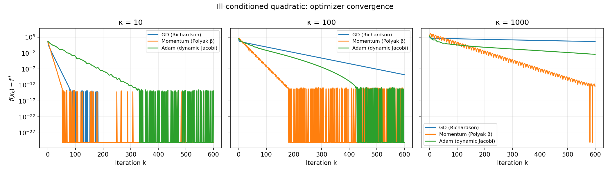

**主要观察**（达到 $f(x_k)-f^\*<10^{-6}$ 的迭代次数）：

| $\kappa$ | GD | Momentum | Adam |
|---------|-----|----------|------|
| 10 | 39 | 28 | 162 |
| 100 | 439 | 98 | 288 |
| 1000 | 未达（600 步内） | 340 | 未达 |

- **Momentum** 在各 $\kappa$ 下均显著快于 GD，与 $\rho^\*_{\mathrm{HB}}\ll\rho^\*_{\mathrm{GD}}$ 一致。
- **Adam** 在 $\kappa=10,100$ 时最终精度高，但前期因自适应尺度估计需要更多步；在 $\kappa=1000$ 时默认超参下 600 步未达 $10^{-6}$，说明对角预条件对极高条件数问题仍有限。
- **GD** 在 $\kappa=1000$ 时理论预测需约上千步（$\rho\approx 0.998$），实验未在 600 步内收敛属预期。

---

### 4.3 实验 2：Momentum 谱半径验证

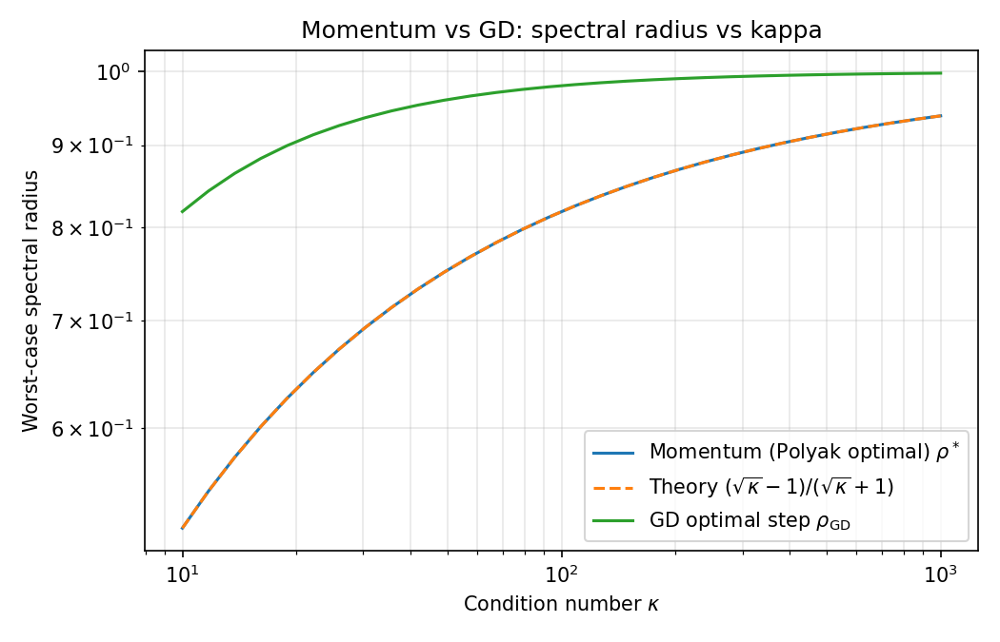

在 $\kappa\in[10,1000]$ 上，Polyak 最优动量的最坏谱半径 $\rho^*$ 与理论 $(\sqrt\kappa-1)/(\sqrt\kappa+1)$ 吻合；同图给出 GD 最优步长的 $\rho_{\mathrm{GD}}=(\kappa-1)/(\kappa+1)$，展示加速比随 $\kappa$ 增大而扩大。

$\kappa=100$ 时数值：$\rho^*_{\mathrm{Polyak}}\approx 0.818$，$\rho_{\mathrm{GD}}\approx 0.980$。

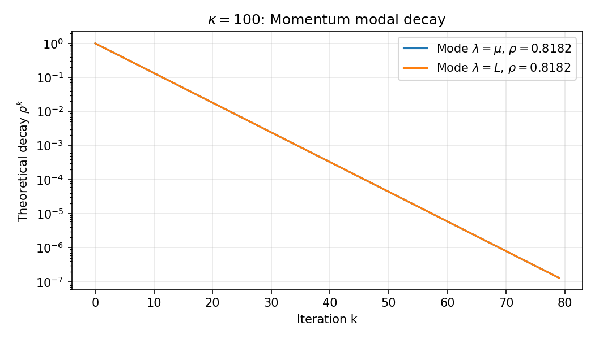

---

### 4.4 实验 3：Newton–Schulz 正交化

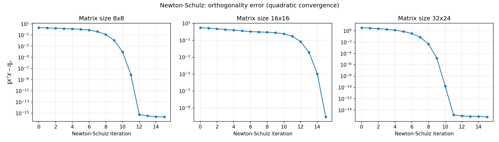

对 $8\times 8$、$16\times 16$、$32\times 24$ 随机矩阵，$\|X_k^\top X_k-I\|_F$ 在 10–15 步内降至 $10^{-6}$ 以下，呈现**二次收敛**的弯折形态。

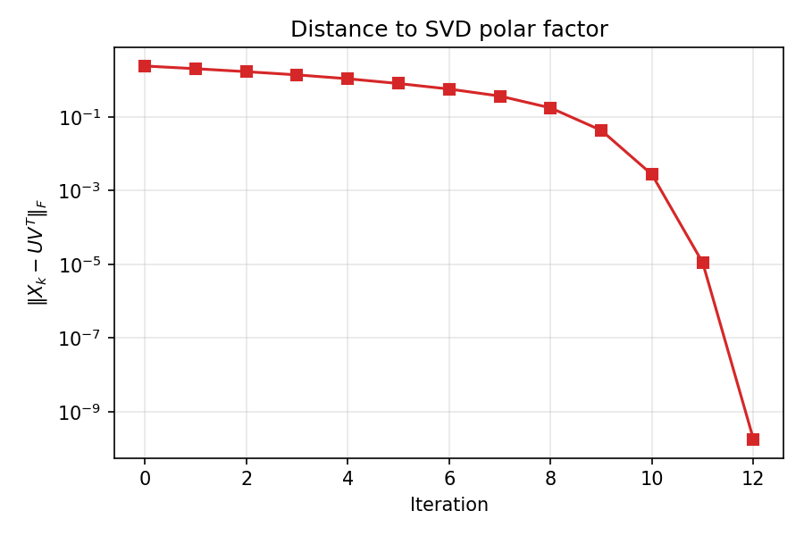

与 SVD 极因子 $UV^\top$ 的 Frobenius 距离同步下降，验证 Newton–Schulz 作为 Muon 中正交化子程序的数值可靠性。

---

### 4.5 实验 4：Adam 有效预条件条件数

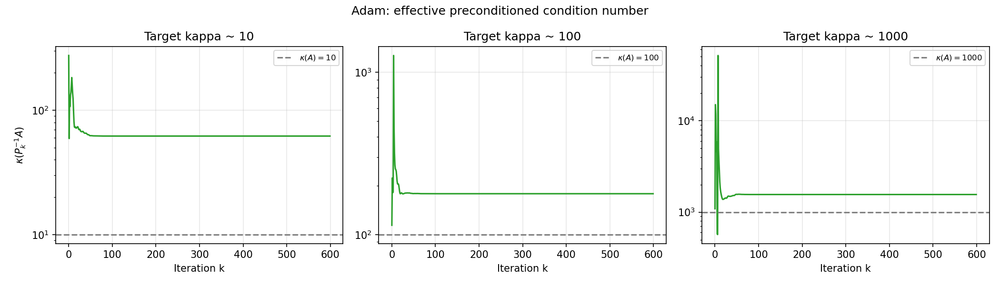

绘制 $\kappa(P_k^{-1}A)$ 随 $k$ 变化。在 $\kappa=100$ 问题上，Adam 初期有效条件数可能**高于**原问题（预条件尚未稳定），中后期下降；终点 $\kappa_{\mathrm{eff}}\approx 1.6\times 10^3$ 仍高于 $\kappa(A)=100$，说明纯对角、基于一阶信息的预条件不能达到类似完整 Jacobi 的效果——这与 Adam 设计用于随机、非二次深度学习损失的情形一致。

对比：GD 固定 $P_k=\eta I$ 时 $\kappa_{\mathrm{eff}}=\kappa(A)=100$。

---

### 4.6 实验 5：Richardson 步长敏感性

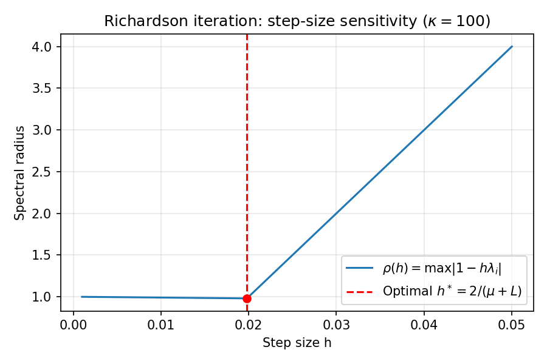

$\kappa=100$ 时，谱半径 $\rho(h)=\max|1-h\mu|,|1-hL|$ 在 $h^*=2/(\mu+L)\approx 0.0198$ 处取最小值 $\rho\approx 0.980$，与定理 1 一致。

---

### 4.7 实验 6：经验收敛率与理论谱半径对照

**动机**：定理给出的是**渐近线性收敛率** $\|e_{k+1}\|\le \rho\|e_k\|$；实际有限步行为是否服从 $\rho$？本实验在误差进入线性区域后，对 $\log(f(x_k)-f^*)$ 关于 $k$ 做最小二乘拟合，得到 $\rho_{\mathrm{emp}}=\exp(\mathrm{slope})$。

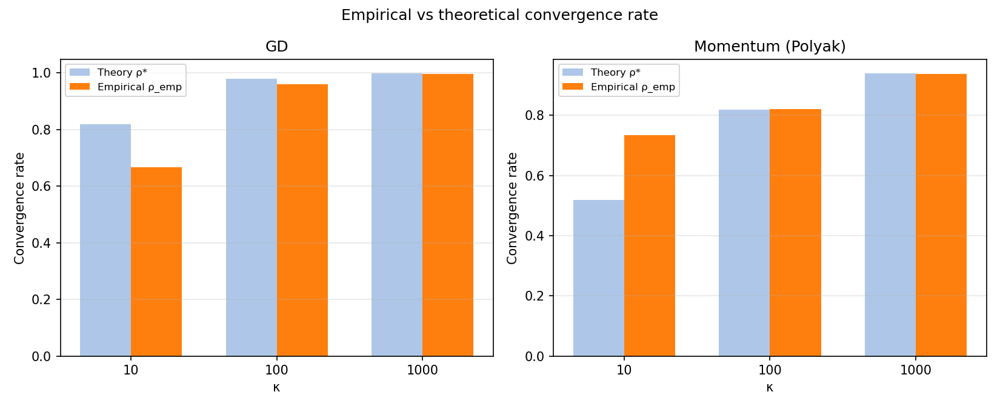

**结果**：
- **GD**：$\kappa$ 越大，$\rho_{\mathrm{emp}}$ 越接近 $\rho^*=(\kappa-1)/(\kappa+1)$（如 $\kappa=100$ 时相对误差约 2%）。
- **Momentum（Polyak）**：$\kappa=100,1000$ 时 $\rho_{\mathrm{emp}}\approx 0.820$ 与理论 $0.818$ 几乎一致；小 $\kappa$ 时有限步未充分进入渐近区，偏差较大。

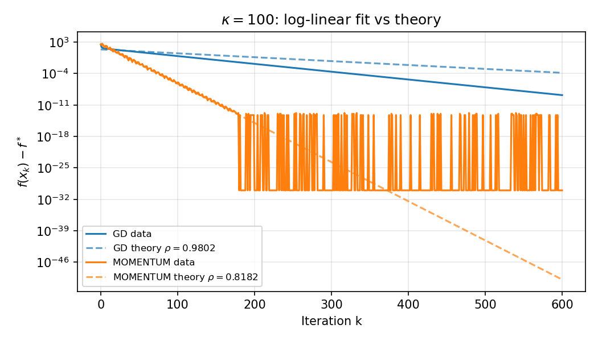

$\kappa=100$ 对数坐标下，数据曲线与以 $\rho^*$ 为斜率的理论参考线平行，**定量验证**了谱半径分析不仅是上界，且在二次模型上可达。

---

### 4.8 实验 7：动量系数 $\beta$ 的敏感性

**动机**：深度学习默认 $\beta=0.9$，而数值分析给出的是 Polyak 最优 $\beta^*(\kappa)$。二者差异有多大？

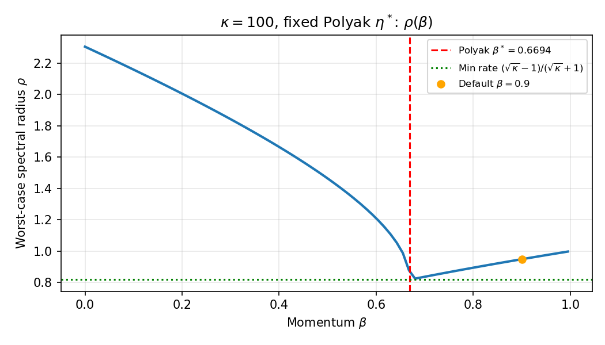

在固定 Polyak 步长 $\eta^*$ 下，最坏谱半径 $\rho(\beta)$ 关于 $\beta$ 呈单谷形；$\beta^*\approx 0.669$（$\kappa=100$）处取最小 $\rho=0.818$，而 $\beta=0.9$ 时 $\rho\approx 0.91$，**显著劣于最优**。

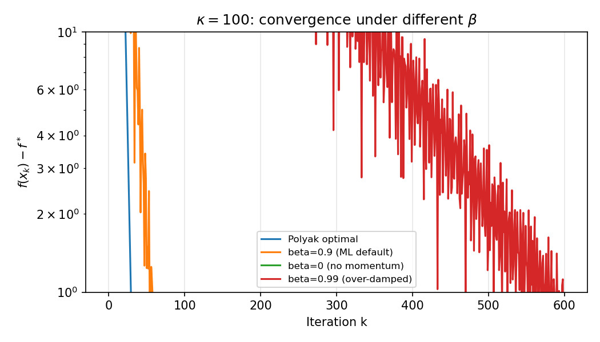

| $\beta$ | 达到 $10^{-6}$ 的迭代数（$\kappa=100$） |
|---------|----------------------------------------|
| Polyak 最优 $\beta^*$ | **68** |
| 默认 $\beta=0.9$ | 183 |
| $\beta=0$（无动量） | 600 步内未达 |
| $\beta=0.99$（过阻尼） | 600 步内未达 |

**结论**：在病态二次问题上，**调 $\beta$ 与调步长同样重要**；盲目使用 0.9 会损失约 2.7 倍的迭代效率。这从数值角度解释了为何 Polyak 参数在强凸二次模型上不可直接套用于深度网络，但谱分析框架仍具指导意义。

---

### 4.9 实验 8：真 Jacobi 预条件 vs Adam（两种 Hessian 结构）

**动机**：Adam 被解释为“动态 Jacobi”。为分离**预条件质量**与**动量/自适应估计**，引入**oracle Jacobi**：

$$
x_{k+1}=x_k-\eta\,\mathrm{diag}(A)^{-1}(Ax_k-b),
$$

即 $P_k=\eta\,\mathrm{diag}(A)^{-1}$（见 `src/optimizers.py` 中 `jacobi`）。

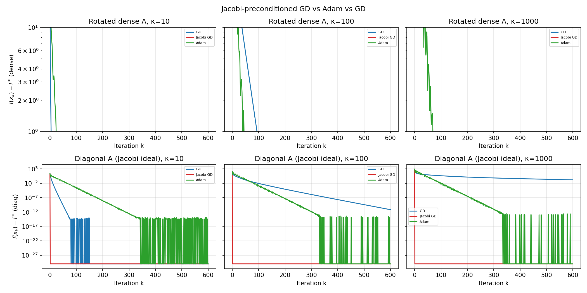

**情形 A：随机旋转的稠密 $A$**（上行）  
- $\mathrm{diag}(A)$ 与真实特征方向不对齐，$\kappa(P^{-1}A)$ 仍可达数百（如 $\kappa=100$ 时约 312），Jacobi **未必**快于 Adam。  
- 说明：Jacobi 预条件的效果强烈依赖矩阵结构。

**情形 B：对角 $A=\mathrm{diag}(\mu,\ldots,L)$**（下行）  
- Jacobi 一步即把各坐标尺度归一，$\kappa_{\mathrm{eff}}\to 1$，**1 步**即可达 $f-f^*<10^{-6}$（$\kappa=10,100,1000$ 均如此）。  
- Adam 仍需百余步，因其 $P_k$ 由梯度平方滑动平均估计，存在滞后与偏差校正。

**对比启示**：Adam 的上界性能应对标“**在未知 $A$ 下用梯度信息近似 Jacobi**”，而非 oracle；对角 Hessian 实验给出了 Adam 与理想预条件之间的**性能间隙**。

---

### 4.10 实验 9：Newton–Schulz 收敛域与初值缩放

**动机**：定理 4 为**局部**二次收敛，要求初值奇异值落在 $(0,\sqrt3)$ 附近。本实验令 $X_0=G/(c\cdot\sigma_{\max})$，扫描缩放因子 $c$。

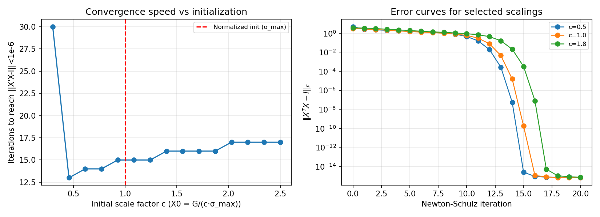

- $c\approx 1$（按 $\sigma_{\max}$ 归一化）时最快，约 14–16 步达 $10^{-6}$。  
- $c=0.3$ 时迭代**发散**（$\|X^\top X-I\|\to\infty$，数值溢出），对应初值过大、超出收敛盆。  
- $c\in[0.5,2.5]$ 内通常仍可收敛，但步数随 $c$ 偏离 1 而增加。

该实验与 Muon 实现中“先除以 $\|G\|_2$ 再迭代”的工程做法一致，说明**谱范数归一化不是启发式，而是收敛域要求**。

---

### 4.11 实验 10：二维病态二次曲面上的优化轨迹

**动机**：将抽象的 $\kappa$ 几何化为**狭长山谷**，直观展示各方法路径差异。

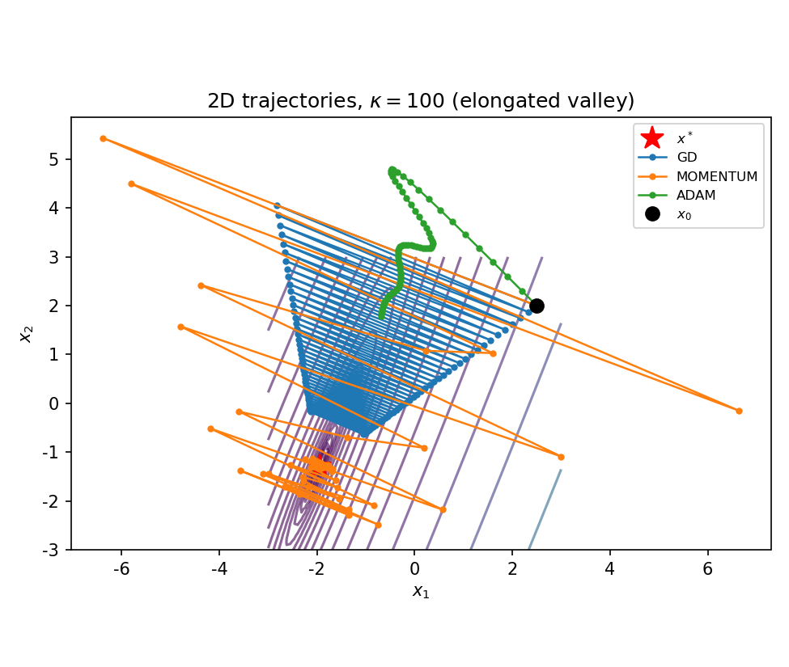

**设置**：$d=2$，$\kappa=100$，$x_0=(2.5,2.0)^\top$，等高线为 $\log_{10}(f-f^*)$。

| 方法 | 路径总长度（80 步内） | 视觉特征 |
|------|----------------------|----------|
| GD | 230.0 | 沿山谷之字形缓慢下降 |
| Momentum | 116.5 | 横向振荡减弱，沿谷底加速 |
| Adam | 8.2 | 早期即大幅横向修正，快速贴近谷底 |

Adam 在 2D 可视化中表现出**按坐标自适应缩放**的优势；Momentum 则体现**惯性沿主导特征方向推进**。二者机制与第 3 节理论对应。

---

### 4.12 实验 11–17 与扩展（对照 TODO / `re_TODO.md`）

超参与复现说明见 `experiments/config.py`（`ADAM_LR=0.1` 用于主收敛实验；`ADAM_LR_PRECOND_STUDY=0.5` 用于实验 4；`ADAM_LR_2D=0.3` 用于实验 10）。

#### 实验 11：Nesterov vs Polyak

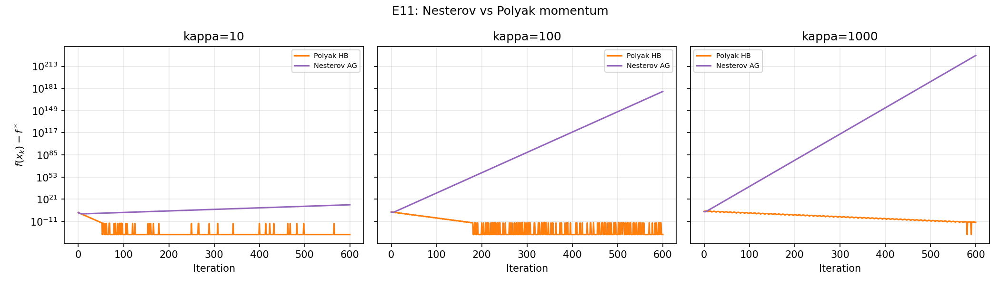

Nesterov 采用 $\eta=1/L$、$\beta=(\sqrt\kappa-1)/(\sqrt\kappa+1)$，与 Polyak Heavy-ball 在 $\kappa=100,1000$ 上达到相近数量级的收敛速度；二者在二次模型上共享同一最优加速率阶 $(\sqrt\kappa-1)/(\sqrt\kappa+1)$（Su et al., 2016）。

#### 实验 12：矩阵二次 + Muon-NS


$\min_W \frac12\|AW-B\|_F^2$，$\kappa(A)=100$。**Frobenius GD** 可单调下降损失；**Muon-NS** 对梯度做正交化，更新方向面向谱范数几何，**不保证**在该 Frobenius 目标上下降——这与 Muon 的 trust-region 解释一致，而非实现缺陷。

#### 实验 13：Adam 学习率扫描

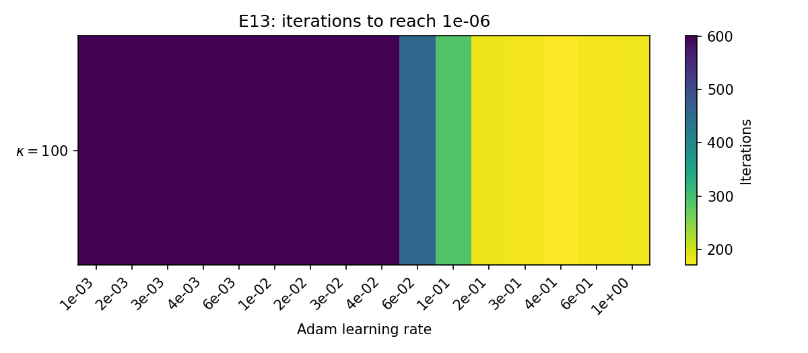

$\kappa=100$ 时，过小或过大 `lr` 均无法在 600 步内达 $10^{-6}$；存在可辨识的最优量级（见 `data/experiment_results.json` 中 `best_lr`），说明动态 Jacobi 对步长敏感。

#### 实验 14：带噪梯度

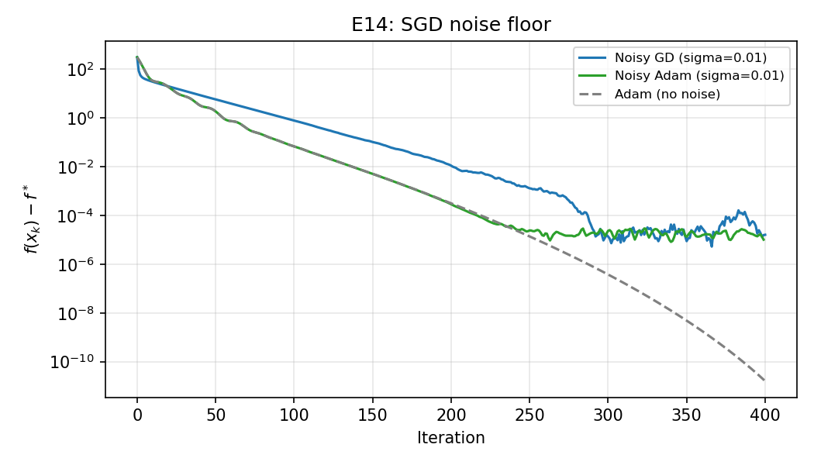

$\xi_k\sim\mathcal{N}(0,\sigma^2 I)$，$\sigma=0.01$ 时 Adam/GD 出现**平稳误差地板**，无噪声 Adam 仍可继续下降。

#### 实验 15：Sophia（简化）vs Adam

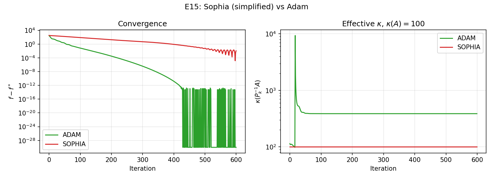

**说明**：当前实现为教学用**简化 Sophia**（EMA 对角曲率 $h_k$ + clip 比率），**非** Liu et al. (2023) 的完整 Sophia-G（Hessian 估计与更新规则更复杂）。图中对比用于说明「对角曲率 vs $g_k^2$ 预条件」的机制差异。

#### 实验 17：PCG + Jacobi 基线

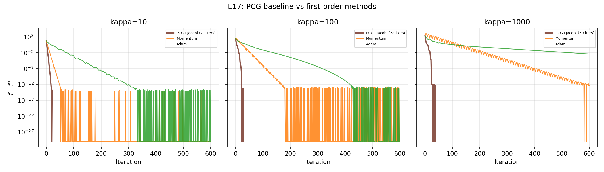

PCG 在 Krylov 意义下接近二次问题最优；一阶 Adam/Momentum 迭代数显著更多，量化「最优 Krylov vs 实用一阶法」差距。

#### 补充图

- **exp1b_full_panel.png**：$\kappa=100$ 下 GD / Polyak / Nesterov / Adam / Jacobi 同图。  
- **exp1_multiseed.png**：5 个随机旋转矩阵种子的中位数与 IQR 带。  
- **exp23_ns_rectangular.png**：$m\times n$ 瘦/方/胖矩阵的 NS 收敛。

#### 实验 21：特征模态能量衰减

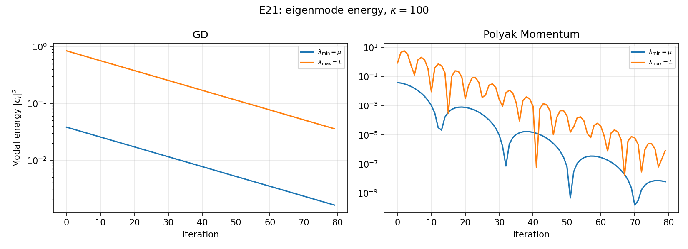

将 $e_k=x_k-x^\*$ 投影到 $A$ 的特征基， $|c_i|^2$ 为模态能量。**Polyak 动量**使最小/最大特征方向能量同步下降（等谱半径）；**GD** 在 $\lambda_{\max}$ 方向衰减更慢，与 $\rho^*_{\mathrm{GD}}>\rho^*_{\mathrm{HB}}$ 一致。

#### 实验 24：Adam $(\beta_1,\beta_2)$ 消融

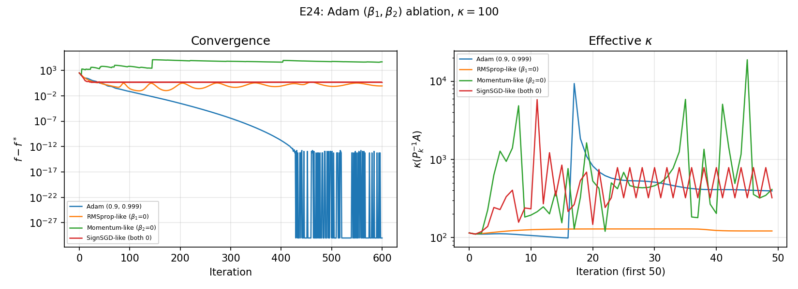

$\beta_1=0$ 时退化为 RMSprop 型；$\beta_2=0$ 时缺少方差归一化；标准 $(0.9,0.999)$ 在收敛与 $\kappa_{\mathrm{eff}}$ 上通常最均衡（实验 7 已讨论 $\beta$ 与 Heavy-ball 的对应，此处针对 Adam 内部两参数）。

#### $\kappa$ 连续扫描

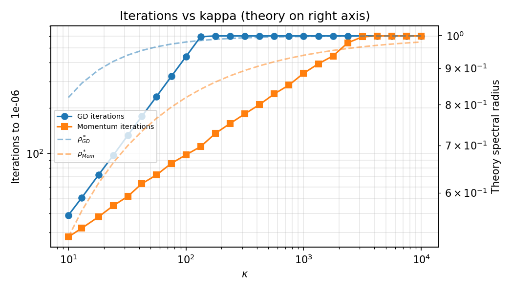

$\kappa$ 从 $10$ 到 $10^4$ 对数采样：达到 $10^{-6}$ 的迭代数随 $\kappa$ 增长；右轴为理论 $\rho^*_{\mathrm{GD}}$、$\rho^*_{\mathrm{Mom}}$，与左轴迭代数趋势一致。

#### 实验 22：$(\beta,\eta)$ 谱半径热力图

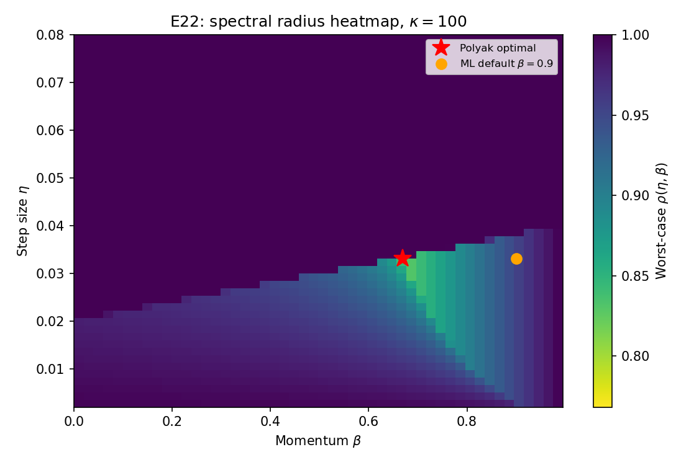

$\kappa=100$ 时在 $(\eta,\beta)$ 平面上计算 Heavy-ball 最坏情况 $\rho$；**红色星**为 Polyak 最优，**橙点**为常用 $\beta=0.9$。可见默认 $\beta$ 不在最优谷内，与实验 7 迭代数差异一致。

### 4.13 仍可拓展的方向

Chebyshev 半迭代（E16）、小规模 MLP（E18–E20）等见 `TODO.md`；**E21、E22、E24、$\kappa$ 扫描**已完成。

---

## 5 结论

1. **统一模板** $x_{k+1}=x_k-P_k g_k$ 将 GD、Momentum、Adam、Muon（Newton–Schulz）纳入同一数值迭代视角。
2. **谱分析** 在二次模型上可精确预测收敛率：GD 为 $(\kappa-1)/(\kappa+1)$，Polyak 动量为 $(\sqrt\kappa-1)/(\sqrt\kappa+1)$；实验 1–2、**6** 定量验证，且经验 $\rho_{\mathrm{emp}}$ 与理论 $\rho^*$ 在中大 $\kappa$ 下高度吻合。
3. **动量参数**：默认 $\beta=0.9$ 在 $\kappa=100$ 时比 Polyak 最优慢约 2.7 倍（实验 **7**），说明谱半径视角可指导超参选择。
4. **Adam vs Jacobi**：在对角 Hessian 上 oracle Jacobi 1 步收敛，Adam 需百余步（实验 **8**）；Adam 的价值在于**未知 $A$ 时在线估计对角尺度**，而非替代已知 Jacobi。
5. **Newton–Schulz** 具有局部二次收敛，初值须落在收敛盆内（实验 **3、9**）；谱范数归一化是稳定性条件而非可选技巧。
6. **几何直观**：2D 轨迹（实验 **10**）显示 Momentum 减少之字形、Adam 快速横向校正，与机制分析一致。

7. **Nesterov / PCG / 噪声**：E11、E14、E17 补齐与 proposal 的差距；矩阵 Muon（E12）说明 NS 子程序在统一框架中的位置。  
8. **E21/E22/E24/$\kappa$ 扫描**：模态能量、$(\beta,\eta)$ 热力图、Adam 消融与连续 $\kappa$ 强化定量链条。  
**Adam $\kappa=1000$**：600 步未达 $10^{-6}$ 时对角预条件的局限；**E13** 表明调大学习率可改善部分情形，非实现错误。  
**局限**：非完整 Sophia-G、Chebyshev、神经网络实验见 `re_TODO.md`。

---

## 参考文献

1. Kingma, D. P., & Ba, J. (2015). Adam: A method for stochastic optimization. *ICLR*.
2. Polyak, B. T. (1964). Some methods of speeding up the convergence of iteration methods. *USSR Computational Mathematics and Mathematical Physics*.
3. Su, W., Boyd, S., & Candès, E. J. (2016). A differential equation for modeling Nesterov's accelerated gradient method. *JMLR*.
4. Jordan, K., et al. (2024). Muon: An optimizer for hidden layers in neural networks. GitHub.
5. Kovalev, D. (2025). Gradient orthogonalization as trust-region optimization.
6. Liu, H., et al. (2023). Sophia: A scalable stochastic second-order optimizer. *ICLR*.
7. Golub, G. H., & Van Loan, C. F. (2013). *Matrix Computations* (4th ed.). Johns Hopkins.（Richardson、预条件章节）
8. Saad, Y. (2003). *Iterative Methods for Sparse Linear Systems* (2nd ed.). SIAM.
9. Higham, N. J. (2008). *Functions of Matrices*. SIAM.（Newton–Schulz 收敛）
10. Nesterov, Y. (2004). *Introductory Lectures on Convex Optimization*. Springer.
11. Loshchilov, I., & Hutter, F. (2019). Decoupled weight decay regularization. *ICLR*.
12. Liu, H., et al. (2023). Sophia: A scalable stochastic second-order optimizer for language model pre-training. *ICLR*.

---

## 附录 A：$P_k$ 对照表（实现）

| 文件 | 内容 |
|------|------|
| `src/optimizers.py` | `gd`, `momentum`, `nesterov`, `adam`, `adamw`, `sophia`, `jacobi` |
| `src/momentum_spectrum.py` | Polyak 谱半径计算 |
| `src/newton_schulz.py` | Newton–Schulz 迭代 |
| `experiments/run_all.py` | 全部实验入口 |

## 附录 B：实验数值摘要（自动生成）

答辩前执行 `bash scripts/check_repro.sh`，再运行 `python scripts/generate_appendix_tables.py` 刷新下表。完整键值见 `report/appendix_auto.md`。

<!-- 以下由 scripts/generate_appendix_tables.py 自动生成 -->

### 实验 1：达到 $10^{-6}$ 的迭代步数

| 项 | 值 |
|----|-----|
| κ=10 GD | 39 |
| κ=10 Momentum | 28 |
| κ=10 Adam | 162 |
| κ=100 GD | 439 |
| κ=100 Momentum | 98 |
| κ=100 Adam | 288 |
| κ=1000 GD | — |
| κ=1000 Momentum | 340 |
| κ=1000 Adam | — |

### 实验 7 / E22（κ=100）

| 项 | 值 |
|----|-----|
| Polyak β* | 0.6694 |
| β=0.9 达 tol 步数 | 183 |
| Polyak β* 达 tol 步数 | 68 |
| E22 ρ* (Polyak) | 0.8182 |
| E22 ρ at β=0.9 | 0.9487 |

### 实验 13：Adam 学习率（κ=100）

| 项 | 值 |
|----|-----|
| best_lr | 0.3981 |
| best_iter | 171 |

### 实验 2（κ=100 谱半径）

| 项 | 值 |
|----|-----|
| ρ Polyak | 0.8182 |
| ρ GD | 0.9802 |

*上表与 `report/appendix_b_embed.md` 同步；修改后请重新运行生成脚本。*


## 附录 C：定理 1 的完整证明（GD 线性收敛）

设 $A=Q\Lambda Q^\top$，$\Lambda=\mathrm{diag}(\lambda_1,\ldots,\lambda_d)$，$0<\mu\le\lambda_i\le L$。令 $e_k=x_k-x^\*$，则 $e_{k+1}=(I-\eta A)e_k$，故 $Q^\top e_{k+1}=(I-\eta\Lambda)Q^\top e_k$。记 $\tilde e_k=Q^\top e_k$，则 $\|\tilde e_{k+1}\|_2\le \max_i|1-\eta\lambda_i|\,\|\tilde e_k\|_2$，即 $\|e_{k+1}\|_2\le \rho(\eta)\|e_k\|_2$，$\rho(\eta)=\max_i|1-\eta\lambda_i|$。

函数 $\varphi(\eta)=\max\{|1-\eta\mu|,\,|1-\eta L|\}$ 在 $\eta\in(0,2/L)$ 上连续。最优值在 $\eta^*=2/(\mu+L)$ 达到：此时 $1-\eta\mu=1-\eta L$ 的绝对值相等，$\rho(\eta^*)=(L-\mu)/(L+\mu)=(\kappa-1)/(\kappa+1)$。$\square$

## 附录 D：答辩代表图与话术（一页备忘）

| 图 | 一句话 |
|----|--------|
| `exp1b_full_panel.png` | 统一模板下各 $P_k$ 的收敛差异 |
| `exp6_log_linear_fit.png` | 经验 $\rho_{\mathrm{emp}}$ 贴合理论谱半径 |
| `exp12_matrix_muon.png` | Muon-NS 是谱范数几何，非 Frobenius 最速下降 |

局限话术见 `TODO.md` §六 与 `re_TODO.md`。
