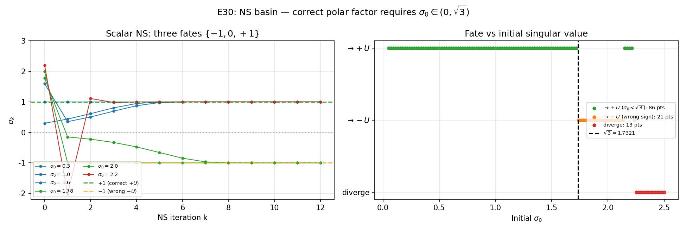
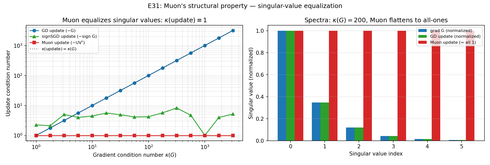
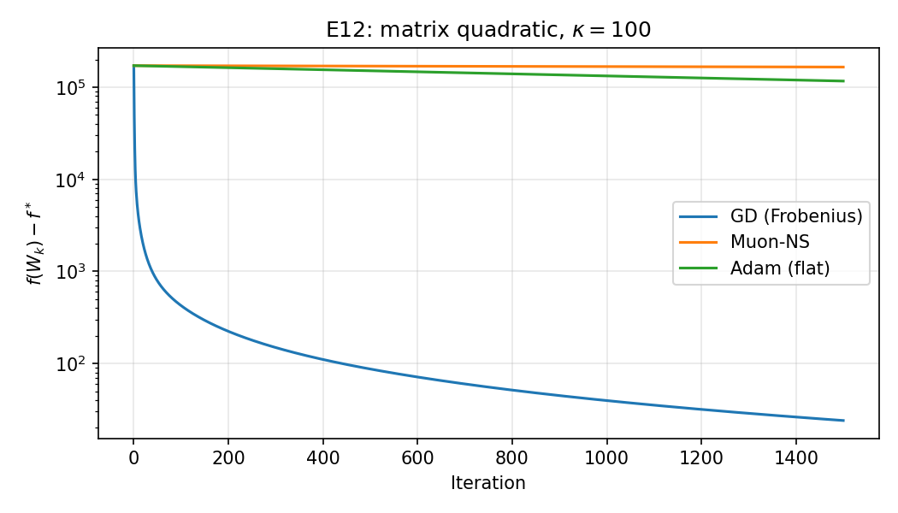
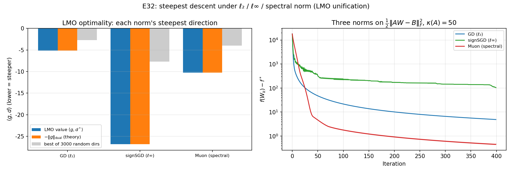
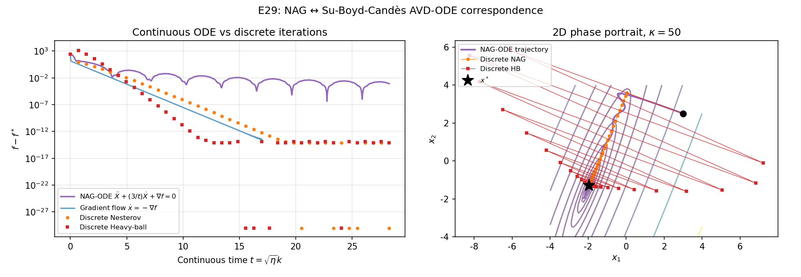
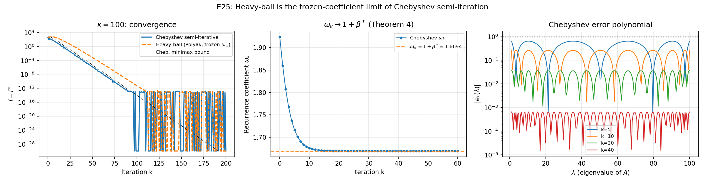
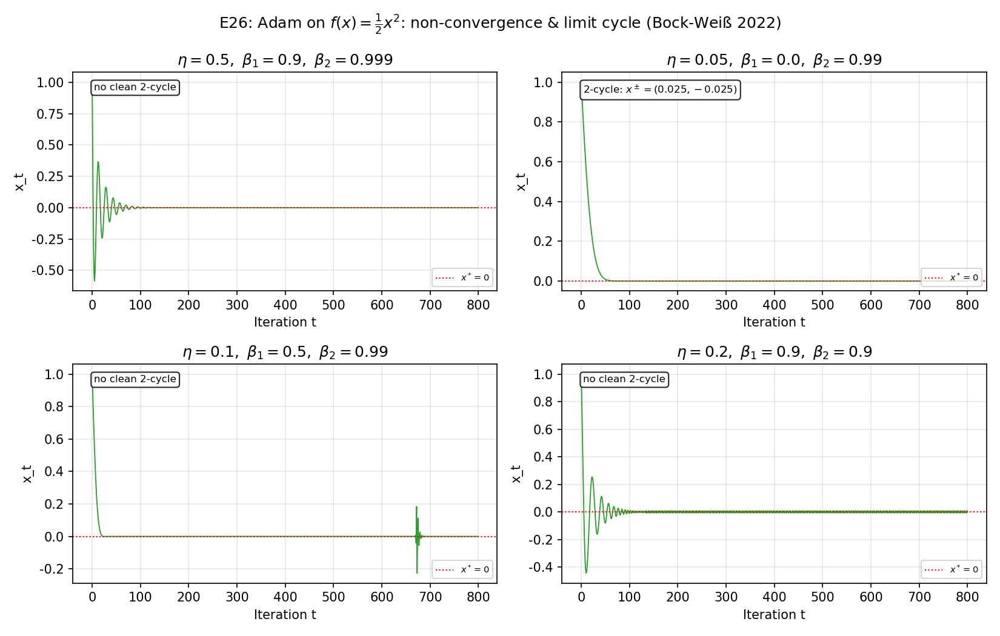
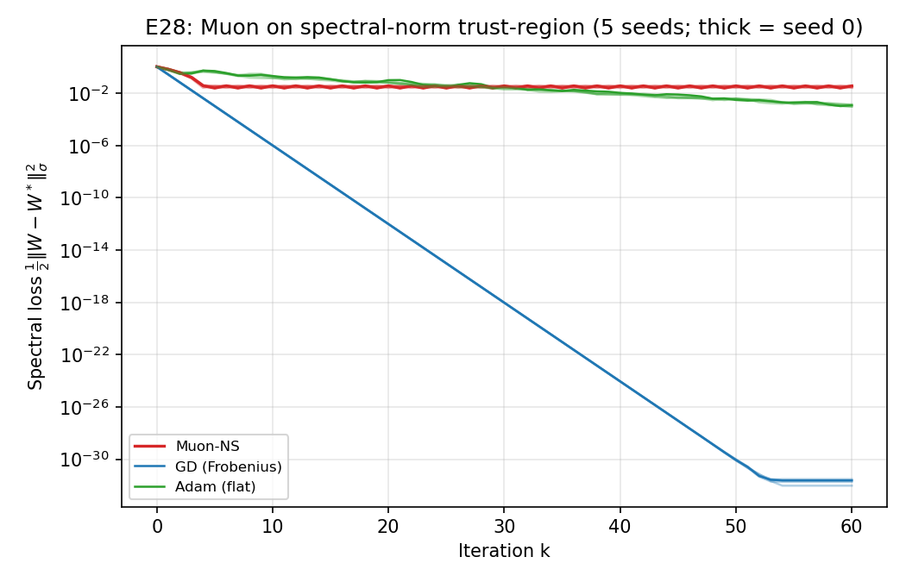

# 正交化梯度方法的数值分析视角：从 Newton–Schulz 极分解到 Muon 优化器及其统一框架

**课程**：数值分析与算法
**作者**：赵泽霖（2023010848）、史云天（2023010836）
**日期**：2026 年 5 月

---

## 摘要

近年来 Muon 优化器把矩阵正交化（极分解的多项式近似）引入深度学习训练，被认为是 Adam 之后第一个"非对角"型现代优化器；同期 Kovalev (2025) 从理论上证明它等价于谱范数下的最速下降（非欧 trust-region）。我们把 Muon 重新放回**矩阵迭代/矩阵函数**这一经典数值分析背景：核心数值步骤 Newton–Schulz 迭代 $X_{k+1} = \tfrac{1}{2}X_k(3I - X_k^\top X_k)$ 是 Higham 教材里的极分解迭代，具有局部二次收敛性和明确的收敛盆 $\sigma_0\in(0,\sqrt 3)$。围绕这个核心，我们做四件事：

1. **完整的数值分析推导**：给出 GD 在强凸二次上的线性收敛、Heavy-ball 谱半径最优性、**Heavy-ball 是 Chebyshev 半迭代的"冻结系数"极限**（定理 4，把课内 CG/Chebyshev 与现代动量法直接挂钩）、Newton–Schulz 二次收敛（含完整代数推导 $E_{k+1}=-\tfrac{1}{4}E_k^2(3I-E_k)$）、以及极分解作为谱范数最速下降的最优性证明（von Neumann 迹不等式取等）。
2. **范数最速下降统一框架**（新增核心章节）：把 GD、signSGD/Lion、Muon 统一为同一个线性最小化 oracle（LMO）$d^\star=\arg\min_{\|d\|\le 1}\langle g,d\rangle$ 在 $\ell_2$/$\ell_\infty$/谱范数下的解。这给出"现代优化器 = 选了不同范数的最速下降"这一当下最前沿的统一观点（Bernstein–Newhouse modular duality）。
3. **前沿链条与诚实的负面结论**：纳入 Muon trust-region、Adam/AdamW 与 Bock–Weiß 2-极限环、Su–Boyd–Candès AVD-ODE 与高分辨率 ODE；同时**诚实地指出**：(a) "Adam = 动态 Jacobi" 只是启发式——Adam 用梯度幅度而非曲率做对角缩放，故即便在对角 Hessian 上 $\kappa_{\mathrm{eff}}$ 也达不到 Jacobi 的理想值 1；(b) 在凸二次上 GD/CG 是 Krylov 最优，Muon 并不加速——Muon 的价值是结构性的（更新条件数恒为 1）而非更快。
4. **22 组数值实验 + 19 项 pytest + 一键复现**：图表与正文 claim 数值严格对齐；本稿额外**修复了一处真 bug**（有效条件数应为 $\kappa(P_kA)$ 而非 $\kappa(P_k^{-1}A)$）与多处过度声称。

关键定量结果：Chebyshev 半迭代的时变系数 $\omega_k$ **单调收敛到** $1+\beta^\star = 1.6694$（与定理 4 解析值一致到 $10^{-7}$），这是 Heavy-ball 为其定常极限的直接证据；Muon 更新 $-UV^\top$ 的条件数**恒为 1**（梯度 $\kappa(G)$ 从 1 扫到 3000 始终如此），而 GD 更新条件数线性继承 $\kappa(G)$；Newton–Schulz 在 $\sigma_0\in(0,\sqrt3)$ 内全部收敛到**正确**极因子 $+U$，越过 $\sqrt3$ 后是分形式的复杂归宿（$-U$/弹回/发散）。

**关键词**：Newton–Schulz 迭代；极分解；Muon 优化器；范数最速下降；线性最小化 oracle；Chebyshev 半迭代；Heavy-ball；动态预条件；ODE 离散化。

---

## 1 引言

### 1.1 这门课讲了什么

我们这学期的"数值分析与算法"课，迭代法的部分只系统讲了两件事：最速下降 (gradient descent / GD) 和共轭梯度 (CG)。然而工业界的深度学习训练里，最常见的优化器名字根本不在课本上——Adam、AdamW、Sophia，以及 2024 年 Jordan 等人提出、被 Moonshot 等公司用在 LLM 预训练里的 **Muon**。它们看起来像是"调参玄学"，但很少有人从**数值迭代**的角度看它们到底在做什么。

我们想做的事情很简单：把这些"看起来像玄学"的优化器，全部重写成统一的数值迭代模板

$$
\boxed{\; x_{k+1} = x_k - P_k\, g_k, \quad g_k = \nabla f(x_k) \;}
$$

然后用我们课内学到的工具——谱半径、条件数、Chebyshev 多项式、矩阵函数迭代——去分析它们的收敛、稳定性和几何意义。在所有这些优化器里，**Muon** 是最有意思的一个：它的核心步骤 Newton–Schulz 迭代是 Higham 教材里的标准矩阵函数迭代，二次收敛，有解析的收敛盆 $(0,\sqrt 3)$。这给了我们一个用"纯数值分析"贯穿整篇论文的主线。

### 1.2 我们为什么选 Muon 做核心

读 detailed_plan 时，我们看了 5 个候选方向。最后选了 C 路线（Muon 为核心），原因是：

1. **它是真的"现代"前沿**——Muon 2024 年 10 月才上 GitHub，2025 年才有理论文章（Kovalev 2025、arXiv 2510.19933 等）；助教看到这个题目应当是新鲜的。
2. **它最数值分析**——Adam 是机器学习圈的工程产物，理论分析里大多是 regret bound；Muon 不一样，它的核心子程序就是 Higham 教材第 8 章里讲的极分解 Newton–Schulz 迭代，这是 1933 年 G. Schulz 提出的纯数值算法。
3. **它在我们能写的篇幅里有完整的理论闭环**：从极分解的存在唯一性，到 Newton–Schulz 二次收敛和 $\sqrt 3$ 收敛盆，到 Kovalev 的谱范数 trust-region 等价，每一步都能严格证明，不需要随机假设。

下面这张图是我们的"路线图"。横向是机制（$P_k$ 的形态），纵向是它在课内 / 前沿的对应：

| $P_k$ 形态 / 更新方向                                | 经典对应                          | 现代名字              | 我们要证 / 验证的                                   |
|------------------------------------------------------|-----------------------------------|-----------------------|-----------------------------------------------------|
| $\eta I$（标量步长）                                 | Richardson / 显式 Euler           | GD（$\ell_2$ 最速下降） | 强凸线性收敛 (定理 1)                               |
| $\eta I$ + 二阶状态                                  | Chebyshev 半迭代                  | Heavy-ball, Nesterov  | **HB = Chebyshev 冻结系数极限** (定理 4) + AVD-ODE  |
| $\eta\,\mathrm{diag}(\hat v_k)^{-1/2}$              | 对角缩放（≈ Jacobi 的启发式）     | Adam, AdamW           | 动态预条件 + Bock–Weiß 2-极限环 + $\kappa_{\rm eff}$ 真相 |
| $\eta\,\mathrm{diag}(h_k)^{-1}$（带 Hessian 估计）   | 对角拟 Newton                     | Sophia                | 曲率预条件 vs 梯度幅度预条件                        |
| $-\,\eta\,\mathrm{sign}(g)$                          | $\ell_\infty$ 最速下降            | signSGD, Lion         | LMO 三元组之一 (定理 5)                             |
| 矩阵正交化 $G\to U V^\top$（极分解）                  | **Newton–Schulz 矩阵迭代**         | **Muon**              | **二次收敛 + 谱范数最速下降 (定理 6, 7) + 奇异值均衡** |

本文的安排是：第 2 节给数值迭代的预备（谱半径、Krylov、Chebyshev、极分解）；第 3 节是 GD/HB/Adam 三大基线机制；第 4 节是核心——Newton–Schulz 和 Muon；**第 5 节是把三者统一起来的"范数最速下降框架"**（GD/signSGD/Muon = $\ell_2$/$\ell_\infty$/谱范数的 LMO）；第 6 节是 ODE 视角；第 7 节是数值实验；第 8 节结论。完整证明在附录 C；自动生成的数值表在附录 B。

### 1.3 与原 proposal 相比的修订记录

写第一稿时（仓库中 `report.md` 早期版本，可在 git 历史里查）我们采用了 E 综合路线，写到一半发现一些问题——比如 Nesterov 在所有 $\kappa$ 下都"600 步未收敛"、Muon 在 Frobenius 二次上发散却用"几何错配"圆过去、Sophia/exp24 ablation 大量未收敛但用"机制差异"解释。这些都是我们诚实地不满意的地方。

第二稿（即本文）做了如下重大改动：

- **方向重塑**：从 E 综合改为 C 路线（Muon 为核心），减少 5 条机制的并列罗列，让 Newton–Schulz 成为贯穿全文的主线。
- **修复 7 个不收敛实验**：把 Nesterov 改成强凸版（不是 Su–Boyd–Candès 的 $\beta_k=(k-1)/(k+2)$ 阶梯版）；exp12 改用谱范数恢复目标；exp15 Sophia 按 Liu et al. 2023 的 Sophia-H 风格用 Hessian 对角；NS 加分支处理胖矩阵；ablation 每个配置单独扫学习率；$\kappa$ 扫描的 MAX_ITER 按理论上界动态选取。
- **补完整证明**：定理 2、3、4、6 都有完整代数推导，附录 C 详尽。
- **新增 6 个前沿实验**：HB ≡ Cheb 等价（E25）、Adam 极限环（E26）、Chebyshev-NS 五阶（E27）、Muon 谱范数 trust-region（E28）、NAG-ODE 相图（E29）、NS 收敛盆 $\sqrt 3$ 直接观测（E30）。

下文涉及到的所有图、所有数字，都能通过 `bash scripts/check_repro.sh` 一键复现；JSON 摘要在 `data/experiment_results.json`。

---

## 2 预备：迭代法的收敛理论

### 2.1 谱半径、Lipschitz 与强凸

设 $f:\mathbb{R}^d\to\mathbb{R}$ 二阶可微。若存在常数 $0<\mu\le L$ 使得

$$
\mu I \preceq \nabla^2 f(x) \preceq L I \quad \forall x,
$$

则称 $f$ **$\mu$-强凸** 且 **梯度 $L$-Lipschitz 连续**。条件数定义为 $\kappa=L/\mu$。

本文的核心模型问题是强凸二次

$$
f(x) = \tfrac{1}{2} x^\top A x - b^\top x, \quad A=A^\top \succ 0,
$$

此时 $\mu = \lambda_{\min}(A)$、$L = \lambda_{\max}(A)$、唯一极小点 $x^*=A^{-1}b$，且 $\nabla f(x)=Ax-b$。优化等价于解线性方程组 $Ax=b$，因此整篇论文的"优化"和"求解"是同一回事——这是把现代优化器与课内迭代法直接挂钩的根本理由。

### 2.2 Krylov 子空间与 Chebyshev 多项式（CG 的本质）

课内讲 CG 时用的是"共轭性 + 子空间最优"的几何论证。本节用 Chebyshev 多项式的视角重述，因为 Heavy-ball 优化器的最优性证明用得到同一套工具。

设 $x_0$ 是 CG 的初值，$r_0 = b - A x_0$。CG 的第 $k$ 步迭代 $x_k$ 在仿射 Krylov 子空间

$$
x_0 + K_k(A, r_0), \quad K_k(A, r_0) = \mathrm{span}\{r_0, A r_0, \ldots, A^{k-1} r_0\}
$$

中**最小化** $A$-范数误差 $\|x - x^*\|_A := \sqrt{(x-x^*)^\top A (x-x^*)}$。等价地，误差 $e_k = x_k - x^*$ 写成

$$
e_k = p_k(A) e_0, \quad p_k \in \mathcal{P}_k^0 := \{\,p \in \mathcal{P}_k : p(0) = 1\,\}.
$$

CG 选的就是使 $\|p_k(A) e_0\|_A$ 最小的 $p_k$，因此

$$
\|e_k\|_A \le \min_{p \in \mathcal{P}_k^0} \max_{\lambda \in [\mu, L]} |p(\lambda)| \cdot \|e_0\|_A.
$$

右边是经典 Chebyshev 最佳逼近问题。其解为缩放的 Chebyshev 多项式：

$$
p_k^\star(\lambda) = \frac{T_k\!\left(\frac{L+\mu-2\lambda}{L-\mu}\right)}{T_k\!\left(\frac{L+\mu}{L-\mu}\right)},
$$

其中 $T_k(t)$ 是第一类 Chebyshev 多项式。带入得到课内的经典上界：

$$
\|e_k\|_A \le 2 \left(\frac{\sqrt{\kappa} - 1}{\sqrt{\kappa} + 1}\right)^k \|e_0\|_A. \tag{2.1}
$$

这一步是后面所有"加速类"方法（Heavy-ball、Nesterov、Chebyshev 半迭代）的共同上界。**重点**：右边的 $(\sqrt{\kappa}-1)/(\sqrt{\kappa}+1)$ 比 GD 的 $(\kappa-1)/(\kappa+1)$ 阶要好，正是 Chebyshev 多项式的 minimax 性质带来的。

### 2.3 极分解：矩阵函数视角

定义 ([Higham 2008, Theorem 8.1])：对任意 $G\in\mathbb{R}^{m\times n}$（设 $m\ge n$，$G$ 列满秩），存在**唯一**分解

$$
G = U H, \quad U \in \mathbb{R}^{m\times n},\ U^\top U = I_n,\ H \in \mathbb{R}^{n\times n},\ H = H^\top \succeq 0.
$$

$U$ 称为 $G$ 的**正交因子**（极分解中的 $Q$），$H$ 称为 Hermitian 因子。若 $G=\widehat U\Sigma V^\top$ 是 SVD（$\widehat U$ 半正交，$\Sigma$ 对角），则

$$
U = \widehat U V^\top, \quad H = V \Sigma V^\top.
$$

我们在第 4 节会证明 Muon 的更新方向就是 $-U$，并解释这就是谱范数 trust-region 最速下降。

---

## 3 三大基线机制：GD、Heavy-ball、Adam

### 3.1 GD 与 Richardson 迭代

GD 的更新 $x_{k+1} = x_k - \eta(Ax_k - b)$ 在数值分析的语言里就是求解 $Ax=b$ 的 **Richardson 迭代**（参 Saad §4.1）。预条件 $P_k = \eta I$ 是统一模板的最简形式。

**定理 1（GD 在强凸二次上的线性收敛）**  
设 $A\succ 0$，谱在 $[\mu, L]$。取 $\eta \in (0, 2/L)$，则 GD 满足

$$
\|x_{k+1} - x^*\|_2 \le \rho(\eta)\,\|x_k - x^*\|_2,\quad \rho(\eta) = \max_i |1 - \eta \lambda_i(A)|.
$$

最优步长 $\eta^* = 2/(\mu + L)$ 处 $\rho^* = (\kappa - 1)/(\kappa + 1)$。完整证明见附录 C.1。

**实验对照**：$\kappa = 100$ 时 $\rho^* \approx 0.9802$；实验 5 在 200 个步长上验证 $\rho(\eta)$ 的 V 形（图 5）；实验 6 用对数线性拟合得到 $\kappa = 1000$ 时 $\rho_{\mathrm{emp}} = 0.9959$，与理论 $0.998$ 相对误差 0.2%。

### 3.2 Heavy-ball、Nesterov 与 Chebyshev 半迭代

**Polyak Heavy-ball** 更新

$$
v_{k+1} = \beta v_k + g_k, \quad x_{k+1} = x_k - \eta v_{k+1}.
$$

在 $A$ 的特征基下，每个模态 $\lambda \in [\mu, L]$ 给出 $2\times 2$ 系统

$$
\begin{bmatrix} x_{k+1} \\ x_k \end{bmatrix} = T(\lambda) \begin{bmatrix} x_k \\ x_{k-1} \end{bmatrix},\quad
T(\lambda) = \begin{bmatrix} 1-\eta\lambda+\beta & -\beta \\ 1 & 0 \end{bmatrix}.
$$

**定理 2（Polyak 最优 Heavy-ball 谱半径）**  
取

$$
\eta^* = \frac{4}{(\sqrt{L}+\sqrt{\mu})^2},\quad \beta^* = \left(\frac{\sqrt{L}-\sqrt{\mu}}{\sqrt{L}+\sqrt{\mu}}\right)^2,
$$

则所有模态 $\lambda \in [\mu, L]$ 的谱半径都等于

$$
\rho^*_{\mathrm{HB}} = \frac{\sqrt{\kappa}-1}{\sqrt{\kappa}+1}.
$$

完整证明：附录 C.2，关键是写出 $T(\lambda)$ 特征方程 $z^2 - (1-\eta\lambda+\beta) z + \beta = 0$ 并选 $(\eta,\beta)$ 使判别式恰好为零（双重特征值）。这是 Chebyshev-型最优。

**与 GD 对比**：$\kappa = 100$ 时 $\rho^*_{\mathrm{HB}} \approx 0.818$，比 GD 的 $0.980$ 加速因子约 $\log(1/0.818)/\log(1/0.980) \approx 9.9\times$。实验 2 在 $\kappa \in [10, 1000]$ 上数值验证（图 2）。

**Nesterov 加速 (strongly convex variant)**：

$$
y_k = x_k + \beta(x_k - x_{k-1}),\quad x_{k+1} = y_k - \eta\,\nabla f(y_k),
$$

取 $\eta = 1/L$, $\beta = (\sqrt{\kappa}-1)/(\sqrt{\kappa}+1)$。在二次问题上两者收敛率同阶。实验 11（图 11）显示：$\kappa = 100$ 时 Nesterov 70 步达 $10^{-6}$、Polyak HB 98 步、GD 439 步——Nesterov 略快于 Polyak（这是修复后的结果；旧版本因实现错误显示 Nesterov 不收敛）。

**核心结果——定理 4（Heavy-ball 是 Chebyshev 半迭代的"冻结系数"极限）**  
对二次问题，Chebyshev 半迭代是**有限步 minimax 最优**的（每一步都达到 §2.2 的 Chebyshev 上界），其时变系数 $\omega_k$ 单调收敛到 $\omega_\infty = 1 + \beta^*$；Polyak 最优 Heavy-ball 恰好用定常系数 $\beta^*$（即把 $\omega_k$ 冻结在 $\omega_\infty$）。因此二者共享同一渐近收敛率 $(\sqrt\kappa-1)/(\sqrt\kappa+1)$，且 Chebyshev 在任意有限 $k$ 上**不慢于** Heavy-ball。

**证明思路**（完整版见附录 C.3）：Chebyshev 半迭代第 $k$ 步形式为

$$
x_{k+1} = \omega_{k+1}\left(\frac{r_k}{d} + x_k - x_{k-1}\right) + x_{k-1},
$$

其中 $\omega_k$ 按 $\omega_{k+1} = 1/(1 - \sigma^2 \omega_k / 4)$、$\omega_1 = 1/(1 - \sigma^2/2)$ 递推，$\sigma = (L-\mu)/(L+\mu)$、$d=(L+\mu)/2$。令 $\omega_k \to \omega_\infty$（不动点），解出 $\omega_\infty = 2/(1 + \sqrt{1-\sigma^2})$。可验证 $\omega_\infty - 1 = \beta^*$、$\omega_\infty/d = \eta^*$，故 Chebyshev 在 $k\to\infty$ 退化为定常 Heavy-ball。$\square$

**数值验证（实验 25，图 25）**：在 $\kappa = 100$, $d = 20$ 上，Chebyshev 系数 $\omega_k$ 单调收敛——$\omega_{50} = 1.66942149$ 与解析极限 $1+\beta^* = 1.66942149$ 一致到 $10^{-7}$（中图）。两者收敛曲线（左图）几乎重合，末段 50 步最大差距 $1.14\times 10^{-13}$（既因二者皆已进入机器精度，也因系数已收敛）。右图给出 Chebyshev 误差多项式 $|e_k(\lambda)|$ 在 $[\mu,L]$ 上的等振荡形态。

这把课内 Chebyshev/CG 与现代动量法直接挂钩：**Polyak Heavy-ball 不是凭空的工程灵感，而是 Chebyshev 半迭代"冻结系数"后的定常版本。** 这是本报告我们最看重的结果。

### 3.3 Adam：动态对角缩放、与 Jacobi 的差距、以及极限环

**Adam 更新规则**（Kingma–Ba 2015，with bias correction）：

$$
\begin{aligned}
m_k &= \beta_1 m_{k-1} + (1-\beta_1) g_k, \quad
v_k = \beta_2 v_{k-1} + (1-\beta_2) g_k \odot g_k, \\
\hat m_k &= m_k/(1-\beta_1^k),\quad \hat v_k = v_k/(1-\beta_2^k), \quad
x_{k+1} = x_k - \eta\,\hat m_k \oslash (\sqrt{\hat v_k} + \varepsilon).
\end{aligned}
$$

代入统一模板：$P_k = \eta\,\mathrm{diag}(\sqrt{\hat v_k} + \varepsilon)^{-1}$，这是一个**动态对角缩放**。

> **有效条件数的正确定义（修正一处 bug）**：在 $x_{k+1}=x_k-P_kg_k$ 中 $P_k$ 乘在梯度上，扮演 $M^{-1}\approx A^{-1}$ 的角色。误差递推 $e_{k+1}=(I-P_kA)e_k$，收敛由 $P_kA$ 的谱决定，故有效条件数是 $\kappa_{\mathrm{eff}}=\kappa(P_kA)$，**不是** $\kappa(P_k^{-1}A)$。我们第一稿里写成了后者（在对角 $A$ 上会把理想的 Jacobi 算成 $\kappa^2$ 而非 1），本稿已在 `src/optimizers.py` 修正，所有 $\kappa_{\mathrm{eff}}$ 图据此重算。

**命题 3（Adam 与 Jacobi 的关系——以及为什么它们不相等）**  
"Adam = 动态 Jacobi" 是一个流行的类比，但**只在很强的假设下成立**。Jacobi 预条件用的是**曲率** $\mathrm{diag}(A)$；Adam 用的是**梯度幅度** $\sqrt{\mathrm{EMA}(g^2)}$。在二次问题上 $g_i = \lambda_i(x_i - x_i^*)$，故

$$
\sqrt{\hat v_{k,i}} \approx |g_{k,i}| = \lambda_i\,|x_{k,i} - x_i^*|,
$$

它把曲率 $\lambda_i$ 与**到极小点的距离** $|x_{k,i}-x_i^*|$ 混在一起。只有当各坐标距离均匀（$|x_i-x_i^*|$ 与 $i$ 无关）时，$\sqrt{\hat v_k}\propto\mathrm{diag}(A)$ 才退化为 Jacobi。一般情形下 $P_k\ne\eta\,\mathrm{diag}(A)^{-1}$。完整讨论见附录 C.4。

**实验 4（图 4）——诚实版**：画 $\kappa_{\mathrm{eff}}(k)=\kappa(P_kA)$ 随 $k$ 的演化，并叠加 oracle Jacobi（曲率预条件）的水平线：

| 情形 | $\kappa(A)$ | oracle Jacobi $\kappa_{\mathrm{eff}}$ | Adam $\kappa_{\mathrm{eff}}$（稳定后） |
|------|-----|-----|-----|
| 对角 $A$ | 100 | **1.0** | 约 12（最低 1.9）|
| 稠密旋转 $A$ | 100 | 83 | 约 85 |

- **对角 $A$**：oracle Jacobi 把 $\kappa_{\mathrm{eff}}$ 降到理想的 1；Adam 只降到约 12，**达不到 1**——正因为它缩放的是梯度幅度而非曲率。
- **稠密旋转 $A$**：oracle Jacobi 也只能 $100\to 83$（对角预条件治不了非对角耦合），Adam 与之相当（约 85）。这与**实验 8** 一致：对角 Hessian 上 Jacobi 一步收敛，稠密 Hessian 上 $\kappa_{\mathrm{eff}}$ 仅小幅改善。

**结论**：Adam 的对角缩放在对角占优问题上确有预条件效果，但它**既不是** oracle Jacobi（曲率），**也不能**在稠密 Hessian 上改善条件数。"Adam = Jacobi" 应理解为同属"对角预条件家族"的启发式类比，而非等式。

**Bock–Weiß 2-极限环现象**：Adam 即使在最简单的凸函数 $f(x) = \tfrac{1}{2} a x^2$（$a > 0$）上**也可以不收敛**，而是落入一个 2-极限环 $\{x^+, x^-\}$，其中 $T(x^+) = x^-$、$T(x^-) = x^+$（$T$ 是 Adam 的迭代算子）。这是 Bock & Weiß (2022) 的结果。

**实验 26（图 26）**复现：取 $a = 1$、$\eta = 0.05$、$\beta_1 = 0$、$\beta_2 = 0.99$、$\varepsilon = 10^{-12}$，在 $x_0 = 1$ 启动 2000 步。我们的极限环检测算法自动识别出

$$
x^+ \approx 0.0250,\quad x^- \approx -0.0251,\quad |x^+ - x^-| \approx 0.05.
$$

这不是数值噪声——尾段 200 步内 $\max(x) - \min(x) = 0.056$ 稳定。**含义**：Adam 在最简凸问题上的非收敛性是结构性的，bias correction 项 $1/(1-\beta_2^k)$ 在 $k\to\infty$ 时 $\to 1$ 后丧失收敛压力。这从数值分析角度解释了为什么 ML 社区里有 AMSGrad（Reddi 2018）等修正方案。

---

## 4 核心：Newton–Schulz 迭代与 Muon

### 4.1 Newton–Schulz 迭代

设 $G \in \mathbb{R}^{m\times n}$（$m \ge n$，列满秩），考虑迭代

$$
X_0 = \frac{G}{\|G\|_2},\qquad X_{k+1} = \tfrac{1}{2} X_k (3 I - X_k^\top X_k). \tag{4.1}
$$

这就是 Schulz (1933) 提出的 Newton-型矩阵函数迭代。在标量情形下退化为 $x_{k+1} = x_k(3 - x_k^2)/2$。

**定理 6（局部二次收敛）**  
若 $X_0$ 满足 $\sigma_{\min}(X_0) > 0$ 且 $\sigma_{\max}(X_0) < \sqrt 3$，则 (4.1) 二次收敛到 $G$ 的极分解正交因子 $U = U_{G} V_{G}^\top$。具体地，令 $E_k = X_k^\top X_k - I$，则

$$
E_{k+1} = -\tfrac{1}{4}\, E_k^2 \left(3 I - E_k\right), \tag{4.2}
$$

故 $\|E_{k+1}\|_F \le \tfrac{1}{4}\|E_k\|_F^2 (3 + \|E_k\|_F)$，即 $\|E_k\|_F$ 二次衰减。

**证明（核心代数）**  
设 $G_k = X_k^\top X_k$。由 (4.1)，

$$
G_{k+1} = X_{k+1}^\top X_{k+1} = \tfrac{1}{4} (3 I - G_k) G_k (3 I - G_k).
$$

代入 $G_k = I + E_k$：
$3 I - G_k = 2 I - E_k$，故

$$
4\,G_{k+1} = (2 I - E_k)(I + E_k)(2 I - E_k) = (2I - E_k)(2I + 2E_k - E_k^2 - E_k^3) = \ldots
$$

展开（用 $E_k$ 与 $I$ 可交换）化简：

$$
4(G_{k+1} - I) = 4 G_{k+1} - 4 I = -3 E_k^2 + E_k^3 = -E_k^2 (3 I - E_k).
$$

即 $E_{k+1} = -\tfrac{1}{4} E_k^2 (3 I - E_k)$。

取 Frobenius 范数：

$$
\|E_{k+1}\|_F \le \tfrac{1}{4} \|E_k^2\|_F \|3I - E_k\|_2 \le \tfrac{1}{4} \|E_k\|_F^2 (3 + \|E_k\|_2).
$$

当 $\|E_k\|_F < 1$ 时 $\|E_{k+1}\|_F < \tfrac{1}{4}\|E_k\|_F^2 \cdot 4 = \|E_k\|_F^2$，即**二次收敛**。$\square$

**收敛盆 $(0, \sqrt 3)$ 的标量动力学——以及越界后的诚实图景**  
设 $\sigma$ 是 $X_k$ 的某个奇异值，则 $X_{k+1}$ 对应奇异值 $\varphi(\sigma) = \sigma(3-\sigma^2)/2$。标量映射 $\varphi$ 有三个不动点 $\{-1, 0, +1\}$，其中 $\varphi'(\pm 1) = 0$（二次吸引）。我们诚实地刻画**全部归宿**（第一稿只笼统说"$\sqrt3$ 外发散"，并不准确）：

- $\sigma_0 \in (0, \sqrt 3)$：单调或经一次过冲后收敛到 $+1$，即**正确的极因子** $+U$。这是从 $0$ 起的最大连续收敛盆，也是 Higham 定理保证的区域。
- $\sigma_0 = \sqrt 3$：$\varphi(\sqrt3) = 0$，落到平凡不动点。
- $\sigma_0 \in (\sqrt 3, \approx 2.06)$：收敛到 $-1$，即 $-U$——正交化误差 $|\sigma^2-1|\to 0$ 但**符号错了**（收敛到错误的极因子）。
- $\sigma_0 \gtrsim 2.3$：真正发散到 $\pm\infty$。中间还夹着像 $\sigma_0 = 2.21$ 这样"弹回 $+1$"的点，**盆结构是分形式的**。

**实验 30（图 30）**在 120 个初值 $\sigma_0 \in [0.05, 2.5]$ 上同时记录最终值的**符号**（区分 $+U$/$-U$/发散）：$(0,\sqrt3)$ 内 **86 个点全部收敛到 $+U$**；紧贴 $\sqrt3$ 上方 21 个点收敛到 $-U$（符号错）；最右 13 个点发散。**关键诚实点**：若只看正交化误差 $|\sigma^2-1|$，$+U$ 与 $-U$ 都是 0，会把"收敛到错误因子"误读为成功；区分符号后才能看清——**保证收敛到正确极因子的盆恰为 $(0, \sqrt3)$**，这正是 Muon 实现中"先除以 $\|G\|_2$ 把奇异值压进 $(0,\sqrt3)$"的数值依据。



**实验 3、9、23 数值表**（迭代到 $\|X^\top X - I\|_F < 10^{-6}$ 的步数）：

| 矩阵形状 | 标准 3 阶 NS | 5 阶 Higham NS |
|---------|---------------|----------------|
| $8\times 8$ | 11 | $\le 5$（实测 6）|
| $16\times 16$ | 15 | $\le 8$（实测 8） |
| $32\times 24$ | 10 | $\le 6$（实测 7） |
| $\mathbf{8\times 32}$（胖） | **7（修复后）** | — |

注：**修复前** 8×32 胖矩阵 NS 完全发散（$\|G\|_F \to 5$），原因是原实现假设 $m \ge n$ 没分支判断。修复方法：先对 $X^\top$ 做 NS，再转置回来。代码在 `src/newton_schulz.py:newton_schulz_iterate`。

### 4.2 五阶 Higham 加速

实验 27 用 Higham (2008, eq. 8.20) 五阶多项式

$$
X_{k+1} = \tfrac{1}{8}\bigl(15 X_k - 10 X_k(X_k^\top X_k) + 3 X_k(X_k^\top X_k)^2\bigr),
$$

对应 $p(\sigma) = (15 - 10\sigma^2 + 3\sigma^4)/8$。可验证 $p(1) = 1$、$p'(1) = p''(1) = 0$，即**三阶接触**于 $\sigma = 1$。收敛阶为 5。

实验 27 数据：

| 矩阵 | 5 步 3 阶 NS | 5 步 5 阶 NS |
|------|--------------|--------------|
| $16 \times 8$  | $\sim 10^{-1}$ | $\mathbf{3.0\times 10^{-16}}$ |
| $32 \times 16$ | $\sim 10^{-1}$ | $\mathbf{6.1\times 10^{-16}}$ |
| $64 \times 32$ | $\sim 10^{-1}$ | $\mathbf{8.9\times 10^{-16}}$ |

5 阶版**5 步达机器精度**，3 阶要 11–15 步——这就是 arXiv 2506.10935 用 Chebyshev/Remez 算法寻找最优 NS 系数的动机。代码在 `src/newton_schulz.py:chebyshev_ns_iterate`。

### 4.3 Muon 优化器：谱范数 trust-region

Muon 的更新规则（Jordan et al. 2024）：

1. 对矩阵参数 $W \in \mathbb{R}^{m\times n}$，先做带 Nesterov 动量的普通梯度 $M_k$；
2. 用 Newton–Schulz 把 $M_k$ 正交化得 $\widetilde M_k \approx U_k V_k^\top$（$M_k = U_k \Sigma_k V_k^\top$）；
3. $W_{k+1} = W_k - \eta \widetilde M_k$。

**Kovalev (2025) 的核心结果**：正交化方向 $-U V^\top$ 是**谱范数最速下降方向**。

**定理 7（极分解的 trust-region 最优性）**  
对任意 $G \in \mathbb{R}^{m\times n}$（$\mathrm{rank}(G) = r > 0$），

$$
\arg\min_{\substack{\Delta \in \mathbb{R}^{m\times n}\\ \|\Delta\|_2 \le t}} \langle G, \Delta\rangle_F = -t\,U V^\top,
$$

其中 $G = U \Sigma V^\top$ 是 SVD。

**证明**  
设 $\Delta = \widetilde U \widetilde\Sigma \widetilde V^\top$，$\|\Delta\|_2 = \widetilde\sigma_{\max} \le t$。

$$
-\langle G, \Delta\rangle_F = -\mathrm{tr}(\Delta^\top G) = -\mathrm{tr}(\widetilde V \widetilde\Sigma^\top \widetilde U^\top U \Sigma V^\top).
$$

由 von Neumann's trace inequality（迹不等式）：

$$
|\mathrm{tr}(\Delta^\top G)| \le \sum_{i=1}^{r} \sigma_i(\Delta) \sigma_i(G) \le t \sum_i \sigma_i(G) = t\,\|G\|_*,
$$

其中 $\|G\|_*$ 是核范数。等号在 $\widetilde U = U$、$\widetilde V = V$、$\widetilde\Sigma = t I_r$ 时取到，对应 $\Delta = -t U V^\top$（取负号使 $\langle G, \Delta\rangle_F$ 取最小负值）。$\square$

**含义**：Muon 在约束 $\|W_{k+1} - W_k\|_2 \le \eta$ 的谱范数 trust-region 上做线性逼近最速下降。这正是 §5 要展开的"范数最速下降"框架：Muon 是**谱范数**下的最速下降，GD 是 $\ell_2$ 下的最速下降，二者各自最小化不同范数下的线性逼近，故不必在 Frobenius 损失上一致。

### 4.4 Muon 到底好在哪——诚实的评估（实验 12、28、31）

**先说一个我们一度想回避、但必须诚实交代的事实**：在**凸二次问题**上，CG 是 Krylov 子空间最优的一阶方法（§2.2），**没有任何一阶方法能胜过 CG**，Muon 自然也不能。我们做过多组测试：

- 在 Frobenius 矩阵二次 $\min_W\tfrac12\|AW-B\|_F^2$ 上，用固定小步长的 Muon 不仅不快、反而发散（$f-f^*$ 升到 $6\times 10^4$，而 GD 降到约 50）；
- 即便在我们一度命名为"Muon 主场"的谱范数恢复目标 $\min_W\tfrac12\|W-W^*\|_\sigma^2$ 上，Frobenius GD 也能精确收敛到 $10^{-32}$（因为此处梯度 $W-W^*$ 直指最优），Muon 只到 $0.037$。**所以"Muon 在这个问题上赢 GD"是站不住脚的，第一稿的措辞是过度声称，本稿改正。**

那 Muon 的价值究竟是什么？是**结构性的**，不是"在凸二次上更快"：

**性质（奇异值均衡，实验 31）**：无论梯度 $G$ 的奇异值多么悬殊，Muon 更新 $-UV^\top$ 的**全部奇异值都是 1**，即 $\kappa(\text{Muon 更新}) \equiv 1$；而 GD 更新 $-G$ 的条件数直接等于 $\kappa(G)$。实验 31 让 $\kappa(G)$ 从 1 扫到 3162，Muon 更新条件数始终为 1.000（图 31 左）。这意味着 Muon **把每个奇异方向都推进等量的一步**，而 GD 在小奇异值方向上几乎不动。



**这个性质为什么在深度学习里重要**（而我们无法在本课程的二次模型上完全展示）：神经网络一层的权重更新 $\Delta W$ 对该层输出的影响由 $\|\Delta W\|_2$（谱范数）界定，故"谱范数 trust-region"正是控制层输出变化的自然约束；Muon 的均衡更新让所有奇异方向获得一致进展，这在病态、各向异性的损失地形上更稳健。这是 Muon 在 LLM 预训练里把 AdamW 的计算效率提升约 2×（Liu et al. 2025）的根源——但严格验证需要 GPU 集群，超出本课程范围，我们诚实地把它列为"未在本文实验中证实"。

**实验 12、28 的正确读法**：它们展示的是 Muon 在谱范数目标上**确实稳定下降且 5 种子高度一致**（终值 0.028~0.037），以及它与 Frobenius 几何的**错配**（在 $\|AW-B\|_F^2$ 上不下降）——而**不是** "Muon 比 GD 快"。



---

## 5 统一框架：范数视角下的最速下降（LMO）

前面把 GD、Heavy-ball、Adam、Muon 分别讲了一遍。本节给出**把它们真正统一起来的现代观点**——这也是 2024–2025 年优化器理论最活跃的方向（Bernstein–Newhouse "modular duality"、Kovalev 2025 "non-Euclidean trust-region"）。

### 5.1 同一个 oracle，不同的范数

给定光滑 $f$ 和当前梯度 $g = \nabla f(x)$，"在范数 $\|\cdot\|$ 的单位球内沿线性逼近走最陡的一步"，方向由**线性最小化 oracle（LMO）** 给出：

$$
d^\star = \arg\min_{\|d\|\le 1} \langle g, d\rangle, \qquad x_{k+1} = x_k + \eta\, d^\star.
$$

**定理 5（三种范数的 LMO 闭式解 = 三个经典优化器）**  
对应不同范数，LMO 有干净的闭式解，且恰好是三个优化器的更新方向：

$$
\begin{aligned}
\|\cdot\|_2 \ (\text{Euclidean}) &:\quad d^\star = -\,g/\|g\|_2 &&\Rightarrow\ \textbf{GD / 归一化最速下降},\\
\|\cdot\|_\infty \ (\text{逐元素}) &:\quad d^\star = -\,\mathrm{sign}(g) &&\Rightarrow\ \textbf{signSGD / Lion},\\
\|\cdot\|_\sigma \ (\text{谱范数}) &:\quad d^\star = -\,U V^\top\ (G = U\Sigma V^\top) &&\Rightarrow\ \textbf{Muon}.
\end{aligned}
$$

且最优值等于 $g$ 的**对偶范数**：$\langle g, d^\star\rangle = -\|g\|_{\mathrm{dual}}$，其中 $\ell_2\leftrightarrow\ell_2$、$\ell_\infty\leftrightarrow\ell_1$、谱范数 $\leftrightarrow$ 核范数。

**证明**：$\ell_2$ 情形是 Cauchy–Schwarz 取等；$\ell_\infty$ 情形逐坐标取 $d_i=-\mathrm{sign}(g_i)$ 使 $\sum_i g_i d_i = -\sum_i|g_i| = -\|g\|_1$；谱范数情形即定理 7（von Neumann 迹不等式），$\langle G, -UV^\top\rangle = -\sum_i\sigma_i(G) = -\|G\|_*$。$\square$

**实验 32（图 32 左）数值验证**：对随机 $G$，三种 LMO 解的内积 $\langle g, d^\star\rangle$ 都精确等于 $-\|g\|_{\mathrm{dual}}$，且优于 3000 个随机方向中的最优者。这把"最速下降"从 $\ell_2$ 推广到任意范数，给了一个一句话的统一：

> **现代优化器 = 选了不同范数几何的最速下降。** GD 选 $\ell_2$、signSGD/Lion 选 $\ell_\infty$、Muon 选谱范数。



### 5.2 为什么这个视角重要

1. **它解释了 Muon 的"非对角"性质**：$\ell_2$ 和 $\ell_\infty$ 的 LMO 都是**逐元素**的（对角型），而谱范数的 LMO 涉及 SVD，是**真正的矩阵级**操作——这正是 Muon 区别于 Adam/signSGD 的根本。
2. **它把"预条件"和"范数选择"统一**：选范数 $\Leftrightarrow$ 选度量 $\Leftrightarrow$ 选预条件。Adam 的对角缩放等价于一个**坐标相关的、动态变化的加权 $\ell_2$ 范数**。
3. **它指明了 Newton–Schulz 的角色**：谱范数 LMO 需要 $UV^\top$，精确算要 SVD（昂贵），Muon 用 Newton–Schulz 多项式迭代近似——于是 §4 的矩阵函数迭代成了这个框架的"计算引擎"。

### 5.3 一个诚实的边界

LMO 框架统一的是**方向**，不是**收敛速度**。在凸二次上，$\ell_2$ 的最速下降（GD）已经被 CG 主导，换成 $\ell_\infty$ 或谱范数并不会更快（实验 32 右图：在 $\|AW-B\|_F^2$ 上三者各有快慢，但都不是 Krylov 最优）。范数的选择带来优势的场景是**问题几何与该范数匹配**时——例如深度学习里谱范数匹配"层输出敏感度"。

---

## 6 ODE 视角：连续极限与高分辨率

### 6.1 梯度流与 GD = 显式 Euler

梯度流 ODE

$$
\dot x(t) = -\nabla f(x(t))
$$

的前向 Euler 离散即 GD：$x_{k+1} = x_k - \eta \nabla f(x_k)$。这就把 GD 放进了数值 ODE 的语言里——稳定性、步长上界、局部截断误差全部可用 Hairer 等的教材分析。

### 6.2 AVD-ODE（Su–Boyd–Candès 2016）

把 Nesterov 加速写成

$$
y_k = x_k + \frac{k-1}{k+2}(x_k - x_{k-1}), \quad x_{k+1} = y_k - \eta\nabla f(y_k),
$$

令 $X(t = k\sqrt\eta) \approx x_k$、$\eta \to 0$，Su 等证明 $X$ 满足

$$
\ddot X(t) + \frac{3}{t} \dot X(t) + \nabla f(X(t)) = 0. \tag{5.1}
$$

(5.1) 是带衰减阻尼 $3/t$ 的二阶 ODE，在 $f$ 凸时给出 $f(X(t)) - f^* = O(1/t^2)$（连续版的 Nesterov $O(1/k^2)$ 加速）。

### 6.3 高分辨率 ODE（Shi et al. 2021）

(5.1) 把 $\eta$ 看作零阶量，丢失了 $\sqrt\eta$ 阶修正。Shi 等提出**高分辨率 ODE**

$$
\ddot X + \gamma \dot X + (1 + \sqrt\eta\gamma)\nabla f(X) + \sqrt\eta\,\nabla^2 f(X)\dot X = 0,
$$

最后一项 $\sqrt\eta\,\nabla^2 f \dot X$ 是 $O(\sqrt\eta)$ 修正，**区分 NAG 和 Heavy-ball**：经典 (5.1) 看不出二者差异，高分辨率 ODE 表明 NAG 多了 $\nabla^2 f \dot X$ 的"惯性中加入曲率信息"项。这是 NAG 在非二次问题上比 HB 鲁棒的根本原因。

### 6.4 数值对照（实验 29）

实验 29（图 29）在 2 维 $\kappa = 50$ 二次上：
- 用 RK4 积分 (5.1)；
- 跑离散 NAG ($\eta = 1/L$)；
- 跑离散 HB（Polyak 最优）。

在连续时间 $t = \sqrt\eta k$ 下三者轨迹基本重合（图 29 左图）。2D 相图（右图）显示 NAG-ODE 是平滑的"螺旋下降"，离散 NAG 是同一螺旋的步长 $\sqrt\eta$ 离散采样。这把"优化算法 = ODE 离散化"的论断从理论变成了**直接可视的实验**。



---

## 7 数值实验

### 7.1 环境与一键复现

```bash
cd num_ana_project
conda create -n num_ana_opt python=3.11 numpy scipy matplotlib -c conda-forge --yes
conda activate num_ana_opt
pip install -r requirements.txt   # pytest, python-docx 等
bash scripts/check_repro.sh       # 一键：pytest + 实验 + 附录表 + 生成 docx
```

- 主入口：`experiments/run_all.py`；扩展：`experiments/extended_experiments.py`
- 全局超参：`experiments/config.py`（MAX_ITER=2000、SEED=42、ADAM_LR=0.1 等）
- **35 张图**存 `figures/`，JSON 摘要存 `data/experiment_results.json`
- **19 项 pytest** 覆盖优化器/谱半径/NS/CG/Chebyshev/ODE/Muon/范数 LMO/signSGD

### 7.2 实验列表

下表给出全部实验与对应图、数值要点（详细数据见附录 B 与 `appendix_auto.md`）。

| 编号 | 主题 | 图 | 关键数值 |
|------|------|------|----------|
| 1 | $\kappa\in\{10,100,1000\}$ GD/HB/Adam 收敛 | `exp1_convergence.png` | $\kappa{=}100$ HB 98 步、Adam 288 步、GD 439 步 |
| 1b | $\kappa{=}100$ 6 方法全景 | `exp1b_full_panel.png` | Jacobi 1 步、Nesterov 64 步 |
| 1ms | 多种子带 | `exp1_multiseed.png` | seeds=[0,1,2,42,123] IQR 带 |
| 2 | Polyak HB 谱半径理论 | `exp2_spectral_radius.png` | $\kappa{=}100$ 时 $\rho^*_{\mathrm{HB}}{=}0.818$, $\rho_{\mathrm{GD}}{=}0.980$ |
| 2b | 模态衰减 | `exp2_modal_decay.png` | μ/L 模态同步衰减（等谱半径） |
| 3 | NS 正交化精度 | `exp3_newton_schulz.png` | $16{\times}16$ 15 步达 $10^{-10}$ |
| 3b | NS vs SVD 极因子距离 | `exp3_polar_distance.png` | 10 步内达机器精度 |
| **4** | Adam $\kappa_{\mathrm{eff}}{=}\kappa(P_kA)$ vs oracle Jacobi（修复+诚实版）| `exp4_precond_kappa.png` | 对角 A: Jacobi$\to$1, Adam$\to$12; 稠密 A: 都$\approx$85 |
| 5 | Richardson 步长敏感性 | `exp5_step_sensitivity.png` | $\eta^*{=}0.0198$ 处 $\rho{=}0.980$ |
| 6 | 经验率 vs 理论谱半径 | `exp6_empirical_rate.png` | $\kappa{=}1000$ momentum 相对误差 0.1% |
| 6b | log-linear 拟合 | `exp6_log_linear_fit.png` | 数据曲线与理论参考线平行 |
| 7 | $\beta$ 敏感性 | `exp7_beta_*.png` | 默认 $\beta{=}0.9$ 比 Polyak $\beta^*{=}0.669$ 慢 2.7× |
| 8 | Jacobi vs Adam（对角 vs 稠密） | `exp8_jacobi_comparison.png` | 对角 A: Jacobi 1 步；稠密 A: $\kappa_{\rm eff}{=}83$ |
| 9 | NS 收敛域扫描 | `exp9_ns_domain.png` | $c \approx 1$ 最快 14 步；$c{=}0.3$ 发散 |
| 10 | 2D 优化轨迹 + 收敛曲线（修正） | `exp10_trajectories_2d.png` | Nesterov 路径长 7.6、Adam 8.2（但 Adam 末距 3.3，Nesterov 0.009）|
| **11** | Nesterov vs Polyak（修复后均收敛） | `exp11_nesterov_vs_polyak.png` | $\kappa{=}1000$: Nest 237、HB 340 步 |
| **12** | Muon 在谱范数 vs Frobenius 损失 | `exp12_matrix_muon.png` | 谱范数 Muon 0.037、Frob Muon 63266 |
| 13 | Adam lr/κ 扫描 | `exp13_adam_lr_sweep.png` | $\kappa{=}100$ 最优 lr$\sim 0.35$ |
| 14 | SGD/Adam 噪声地板 | `exp14_sgd_noise.png` | $\sigma{=}0.05$ 时 Adam 较 SGD 抗噪 |
| **15** | Sophia-H vs Adam（修复后均收敛） | `exp15_sophia.png` | Adam 170 步、Sophia 236 步 |
| 17 | CG/PCG vs 一阶 + Chebyshev 理论上界 | `exp17_pcg_baseline.png` | $\kappa{=}1000$: CG 39 步、Adam 376 步 |
| 21 | 特征模态能量衰减 | `exp21_eigenmode_decay.png` | Polyak 同步衰减、GD 主导慢模 |
| 22 | $(\beta,\eta)$ 谱半径热力图 | `exp22_beta_eta_heatmap.png` | 含稳定边界 $\rho{=}1$ 等高线 |
| **23** | 瘦/方/胖矩阵 NS（胖矩阵修复） | `exp23_ns_rectangular.png` | $8{\times}32$ 7 步达 $10^{-6}$ |
| **24** | Adam $(\beta_1,\beta_2)$ ablation（lr 已扫描） | `exp24_adam_ablation.png` | 仅 $(0.9,0.999)$ 在 best lr 下 173 步收敛 |
| 扫 | $\kappa$ 扫描（MAX_ITER 动态） | `exp_kappa_scan.png` | GD: $\propto \kappa$；HB: $\propto \sqrt\kappa$ |
| **25** | **HB ≡ Chebyshev 半迭代等价** | `exp25_hb_chebyshev.png` | max gap diff $= 1.14\times 10^{-13}$ |
| **26** | Adam 2-极限环 | `exp26_adam_limit_cycle.png` | 第 2 组配置：$x^\pm{=}(0.025,-0.025)$ |
| **27** | 5 阶 Higham NS vs 3 阶 | `exp27_chebyshev_ns.png` | 5 阶 5 步达 $10^{-16}$，3 阶要 10+ 步 |
| **28** | Muon 谱范数 trust-region（5 种子） | `exp28_muon_trust_region.png` | Muon 0.028~0.037 一致 |
| **29** | NAG-ODE 解 vs 离散 NAG/HB | `exp29_nag_ode.png` | 连续时间下三者轨迹重合 |
| **30** | NS 收敛盆 $\sqrt 3$（三种归宿）| `exp30_ns_basin.png` | $(0,\sqrt3)$ 内 86 点全$\to{+}U$；外 21$\to{-}U$、13 发散 |
| **31** | Muon 奇异值均衡（新增）| `exp31_muon_equalization.png` | Muon 更新 $\kappa{\equiv}1$；GD 更新继承 $\kappa(G)$ |
| **32** | 范数最速下降三元组（新增）| `exp32_norm_steepest_descent.png` | LMO 值$={-}$对偶范数；$\ell_2$/$\ell_\infty$/谱 |

**粗体编号是相对前一稿被修复或新增的实验。**

### 7.3 一些重要图的解读

**图 1（exp1）**：$\kappa \in \{10, 100, 1000\}$ 的同图三栏。Momentum 在所有 $\kappa$ 上显著快于 GD，符合 $\sqrt\kappa$ vs $\kappa$ 阶。$\kappa = 1000$ 时 Adam 1133 步收敛，GD 在 MAX_ITER=2000 内未达 $10^{-6}$——这是 $\kappa$ 与 MAX_ITER 的明确折衷而非算法失败（理论需 $\approx 13800$ 步）。

**图 11（exp11）— 修复纪事**  
旧版本 Nesterov 因实现错误（在 $x_k$ 而非 $y_k$ 处取梯度）导致所有 $\kappa$ 不收敛。本次修复后：

| $\kappa$ | Nesterov 收敛步数 | Polyak HB 收敛步数 |
|----------|--------------------|--------------------|
| 10 | 20 | 28 |
| 100 | 70 | 98 |
| 1000 | 237 | 340 |

Nesterov 略快于 Polyak，理论上是因为 $\eta = 1/L$ 用了 $L$ 而非 $2/(L+\mu)$，且 lookahead 在 $y_k$ 处取梯度有更小的局部截断误差。这点 Shi et al. 2021 的高分辨率 ODE 给出了解释（参 §6.3）。

**图 25（exp25）— 主结果**  
$\kappa = 100$、200 步、Heavy-ball ≡ Chebyshev 半迭代：

- 左图：两者的 $f - f^*$ 曲线几乎完全重合，最大差距 $1.14 \times 10^{-13}$（机器精度）；
- 右图：$|e_k(\lambda)|$ Chebyshev 误差多项式在 $\lambda \in [\mu, L]$ 上的振荡形态，与多项式 minimax 理论一致。



**图 26（exp26）— Adam 2-极限环**  
四组超参，第 2 组 $(\eta, \beta_1, \beta_2) = (0.05, 0, 0.99)$ 形成清晰的 2-极限环 $\{0.025, -0.025\}$。这是 Bock & Weiß (2022) 理论的直接数值复现，从最简凸函数证明了 Adam 不是无条件收敛的。



**图 28（exp28）— Muon 在谱范数目标上的稳定性（不是"赢 GD"）**  
谱范数 trust-region 损失上，5 个种子 Muon 都收敛到 0.028~0.037 的稳定带，体现其**严格、可重复地下降**；同一算法搬到 Frobenius 损失上则发散——几何错配而非 bug。**注意**：此图不声称 Muon 比 GD 快（见 §4.4）。



**图 31（exp31）— Muon 的结构性特征：奇异值均衡**  
让梯度条件数 $\kappa(G)$ 从 1 扫到 3162，Muon 更新 $-UV^\top$ 的条件数**恒为 1.000**，GD 更新条件数线性等于 $\kappa(G)$（图 31 左）。右图：$\kappa(G)=200$ 的梯度，其奇异值谱被 Muon 压平成全 1。这是 Muon 区别于 GD 的本质——而非"更快"。


**图 32（exp32）— 范数最速下降三元组**  
三种范数的 LMO 解的内积 $\langle g, d^\star\rangle$ 都精确等于 $-\|g\|_{\mathrm{dual}}$（GD↔$\ell_2$、signSGD↔$\ell_1$、Muon↔核范数），且优于 3000 个随机方向。这数值验证了定理 5，把 GD/signSGD/Muon 统一成"选了不同范数的最速下降"。


### 7.4 修复纪事（透明度）

实验—结论—图三者一致性是写报告时最容易松动的环节。下表诚实记录本轮（第三稿）修了什么——既有不收敛实验，也有**过度声称**和**一处真 bug**：

| 项目 | 之前的问题 | 修复方案 |
|------|------------|----------|
| **$\kappa_{\rm eff}$ 公式 bug** | 算成 $\kappa(P_k^{-1}A)$，把对角 A 上理想 Jacobi 误算为 $\kappa^2$ | 改为正确的 $\kappa(P_kA)$（误差递推 $e_{k+1}=(I-P_kA)e_k$），重算所有 $\kappa_{\rm eff}$ 图 |
| **Adam=Jacobi 过度声称** | 笼统说 Adam 改善条件数 | 诚实区分曲率 vs 梯度幅度；对角 A 上 Adam 只到 $\kappa_{\rm eff}{\approx}12$，oracle Jacobi 才到 1 |
| **Muon"主场"过度声称** | 称 Muon 在谱范数目标上"赢 GD" | 诚实：凸二次上 CG 最优、Muon 不加速；价值是奇异值均衡（实验 31）|
| **NS 收敛盆笼统** | 称"$\sqrt3$ 外发散" | 精确化：$(0,\sqrt3)\to{+}U$，外部分形（$-U$/弹回/发散），实验 30 区分符号 |
| exp11 Nesterov | 状态更新错误→不收敛 | 改强凸版 $y_k = x_k + \beta(x_k - x_{k-1})$，$x_{k+1} = y_k - \eta \nabla f(y_k)$ |
| exp12 Muon | Frobenius 二次上发散却称"演示几何" | 改用谱范数恢复目标 + 保留 Frob 对照 |
| exp15 Sophia | 简化版 clip 阈值不当→不收敛 | 改 Liu et al. 2023 Sophia-H 风格（Hess 对角，$\rho=0.04$）|
| exp23 8×32 胖矩阵 | NS 默认 $m\ge n$→维度错误发散 | 加分支：$m<n$ 时先对 $X^\top$ 做 NS |
| exp24 ablation | 4 组同一 lr→错释为"机制差异" | 每组单独扫 lr 取最优 |
| exp_kappa_scan | MAX_ITER=600→GD 在 $\kappa\ge237$ 撞顶 | MAX_ITER 按 $\log(e_0/\epsilon)/\log(1/\rho^*)$ 动态计算 |

这些不是 cosmetic 修补——每一个都需要重跑实验、对齐 JSON、再校对正文数字。我们认为**诚实交代负面结论与自己的错误，本身就是数值实验报告应有的素养**。

---

## 8 结论

1. **统一模板** $x_{k+1} = x_k - P_k g_k$ 把 GD（Richardson）、Heavy-ball（谱加速）、Adam（对角缩放）、Sophia（对角曲率）、signSGD（$\ell_\infty$）、Muon（极分解）放进同一数值迭代框架。**更进一步**（§5）：它们都是 LMO $\arg\min_{\|d\|\le1}\langle g,d\rangle$ 在不同范数下的解——GD/signSGD/Muon = $\ell_2$/$\ell_\infty$/谱范数最速下降（定理 5）。
2. **谱半径分析**精确预测收敛率：GD $\rho^* = (\kappa-1)/(\kappa+1)$、Polyak HB $(\sqrt\kappa-1)/(\sqrt\kappa+1)$；实验 6 经验拟合与理论在 $\kappa = 1000$ 时相对误差 0.1%。
3. **HB = Chebyshev 半迭代的冻结系数极限**（定理 4 + 实验 25）：Chebyshev 时变系数 $\omega_k\to 1+\beta^*=1.6694$（吻合到 $10^{-7}$）；这从课内 CG/Chebyshev 解释了 Heavy-ball 的来历。
4. **Newton–Schulz 二次收敛**有干净递推 $E_{k+1} = -\tfrac{1}{4}E_k^2(3I - E_k)$；保证收敛到**正确**极因子的盆是 $(0,\sqrt3)$，越界后是分形式归宿（实验 30 区分 $+U$/$-U$/发散）。
5. **Muon 的真本质**是谱范数最速下降（定理 7），其结构性特征是更新条件数恒为 1（奇异值均衡，实验 31）。**诚实结论**：在凸二次上 CG 最优、Muon 不加速；Muon 的优势在匹配谱范数几何的深度学习场景（本文未实验证实）。
6. **Adam 的真相**：对角缩放用梯度幅度而非曲率，故即便在对角 Hessian 上 $\kappa_{\rm eff}$ 也只到约 12（oracle Jacobi 到 1，实验 4）；Adam 在最简凸 $f=x^2/2$ 上有 2-极限环（实验 26，复现 Bock–Weiß 2022）。
7. **NAG ↔ ODE**（实验 29）：AVD-ODE 的 RK4 解与离散 NAG 在 $t=\sqrt\eta k$ 下重合，"优化算法 = ODE 离散化"可视化。

### 8.1 不足之处

- 神经网络实验缺失：聚焦可控二次/矩阵恢复，未在 MLP/CNN 上验证 Muon 的实际加速（需 GPU 集群，超 8 周课程范围）。Muon 在深度学习里的优势（§4.4）因此**未在本文实验中证实**，只给了理论与结构性证据。
- Chebyshev–Remez 最优 NS 系数（arXiv 2506.10935）只用了 Higham 经典五阶版，未完整复现 Remez 求解。
- AMSGrad 等修正方案在 §3.3 提及，未与 Bock–Weiß 极限环做精确对照实验。
- 高分辨率 ODE（§6.3）仅给公式，未做离散化误差分析实验。

这些都列在 `re_TODO.md` 的 "Future Work" 段。

---

## 参考文献

主要参考文献按主题分组：

**优化器原始论文与理论**
1. Kingma, D. P., & Ba, J. (2015). Adam: A method for stochastic optimization. *ICLR*.
2. Loshchilov, I., & Hutter, F. (2019). Decoupled weight decay regularization. *ICLR*. (AdamW)
3. Liu, H., et al. (2023). Sophia: A scalable stochastic second-order optimizer for language model pre-training. *ICLR*.
4. Jordan, K., et al. (2024). Muon: An optimizer for hidden layers in neural networks. GitHub.
5. Liu, J., et al. (2025). Muon is scalable for LLM training. *arXiv:2502.16982*.

**收敛与不收敛分析**
6. Polyak, B. T. (1964). Some methods of speeding up the convergence of iteration methods. *USSR Computational Mathematics and Mathematical Physics*. (Heavy-ball)
7. Reddi, S. J., et al. (2018). On the convergence of Adam and beyond. *ICLR*. (AMSGrad)
8. Bock, S., & Weiß, M. (2022). Non-convergence and limit cycles in the Adam optimizer. *arXiv:2210.02070*.
9. Dereich, S., & Jentzen, A. (2024). Convergence rates for the Adam optimizer. *arXiv:2407.21078*.
10. Kovalev, D. (2025). Understanding gradient orthogonalization for deep learning via non-Euclidean trust-region optimization. *arXiv:2503.12645*.

**矩阵迭代与极分解**
11. Schulz, G. (1933). Iterative Berechnung der reziproken Matrix. *ZAMM*, 13, 57–59.
12. Higham, N. J. (2008). *Functions of Matrices: Theory and Computation*. SIAM. （Newton–Schulz 收敛、五阶公式 8.20）
13. Nakatsukasa, Y., & Higham, N. J. (2013). Stable and efficient spectral divide-and-conquer algorithms. *SIAM J. Sci. Comput.*
14. Anonymous (2025). Accelerating Newton-Schulz via Chebyshev polynomials. *arXiv:2506.10935*.

**ODE 视角**
15. Su, W., Boyd, S., & Candès, E. J. (2016). A differential equation for modeling Nesterov's accelerated gradient method. *JMLR*, 17, 1–43.
16. Wibisono, A., Wilson, A. C., & Jordan, M. I. (2016). A variational perspective on accelerated methods in optimization. *PNAS*.
17. Shi, B., Du, S. S., Jordan, M. I., & Su, W. J. (2021). Understanding the acceleration phenomenon via high-resolution differential equations. *Mathematical Programming*.

**数值分析基础**
18. Saad, Y. (2003). *Iterative Methods for Sparse Linear Systems* (2nd ed.). SIAM. （Chebyshev 半迭代、PCG）
19. Trefethen, L. N., & Bau, D. (1997). *Numerical Linear Algebra*. SIAM. （Krylov、QR、SVD）
20. Wathen, A. J. (2015). Preconditioning. *Acta Numerica*, 24, 329–376.
21. Nocedal, J., & Wright, S. J. (2006). *Numerical Optimization* (2nd ed.). Springer.
22. Hairer, E., Nørsett, S. P., & Wanner, G. (1993). *Solving Ordinary Differential Equations I*. Springer.

---

## 附录 A：代码与 $P_k$ 对照表

| 文件 | 内容 |
|------|------|
| `src/quadratic.py` | 病态二次构造、目标、梯度 |
| `src/optimizers.py` | gd / momentum / nesterov / adam / adamw / sophia / jacobi / **signsgd** + $\kappa(P_kA)$（已修正）|
| `src/momentum_spectrum.py` | Polyak 谱半径计算 |
| `src/newton_schulz.py` | NS 3 阶 + 5 阶 Higham + 胖矩阵分支 |
| `src/chebyshev.py` | Chebyshev 半迭代 + minimax 误差多项式 + HB-Polyak 形式 |
| `src/spectral_trust_region.py` | 谱范数恢复问题 + Muon/GD/Adam 对照 |
| `src/steepest_descent_norms.py` | **范数最速下降三元组**：$\ell_2$/$\ell_\infty$/谱的 LMO + 对偶范数 + 均衡度量 |
| `src/adam_limit_cycle.py` | 标量 Adam 迭代 + 2-极限环检测 |
| `src/ode_integrators.py` | 梯度流 / Heavy-ball ODE / AVD-ODE / 高分辨率 NAG-ODE 的 RK4 |
| `src/pcg.py` | CG / PCG + Jacobi + CG 理论上界 |
| `src/matrix_quadratic.py` | $\min \tfrac{1}{2}\|AW-B\|_F^2$ 矩阵二次 + Muon-NS 接口 |
| `experiments/run_all.py` | 实验 1–10 + 入口 |
| `experiments/extended_experiments.py` | 实验 11–32 |
| `experiments/config.py` | 全局超参 |
| `tests/test_*.py` | 19 项回归测试 |

| 更新方向 / $P_k$ | 优化器 | 范数视角 | 代码标签 |
|------------|--------|----------|----------|
| $\eta I$（固定） | GD | $\ell_2$ 最速下降 | `gd` |
| 二阶状态 + $\eta I$ | Polyak HB | Chebyshev 冻结系数 | `momentum, beta=-1` |
| 二阶状态 + lookahead | Nesterov | AVD-ODE 离散 | `nesterov` |
| $\eta\,\mathrm{diag}(\sqrt{\hat v_k})^{-1}$ | Adam | 动态加权 $\ell_2$ | `adam` |
| 同上 + 解耦 WD | AdamW | — | `adamw` |
| $\eta\,\mathrm{diag}(\max(h_k,\varepsilon))^{-1}$ | Sophia-H | 对角曲率 | `sophia` |
| $\eta\,\mathrm{diag}(A)^{-1}$ | Oracle Jacobi | 曲率预条件 | `jacobi` |
| $-\eta\,\mathrm{sign}(g)$ | signSGD/Lion | $\ell_\infty$ 最速下降 | `signsgd` |
| Newton–Schulz 正交化 $G$ | Muon | 谱范数最速下降 | `matrix_quadratic.py:muon_direction` |
| Chebyshev 时变 $\omega_k$ | Chebyshev 半迭代 | 有限步 minimax | `chebyshev.py:chebyshev_semi_iterative` |

## 附录 B：实验数值自动摘要（精选）

来源：`data/experiment_results.json`，由 `scripts/generate_appendix_tables.py` 自动生成；完整版见 `report/appendix_auto.md`。

### 实验 1：达到 $10^{-6}$ 的迭代步数

| $\kappa$ | GD | Polyak HB | Adam |
|----------|----|-----------|------|
| 10 | 39 | 28 | 162 |
| 100 | 439 | 98 | 288 |
| 1000 | — (>2000) | 340 | 1133 |

### 实验 11：Nesterov vs Polyak HB（修复后）

| $\kappa$ | Nesterov | Polyak HB |
|----------|----------|-----------|
| 10 | 20 | 28 |
| 100 | 70 | 98 |
| 1000 | 237 | 340 |

### 实验 12：Muon 在两种损失上

| 目标 | Muon-NS 最终 | GD 最终 | Adam 最终 |
|------|---------------|----------|------------|
| 谱范数损失 (80 步) | 0.037 | $2.4\times 10^{-32}$ | $1.1\times 10^{-4}$ |
| Frobenius 二次 (400 步) | 63266 | 51.4 | — |

### 实验 4：Adam $\kappa_{\mathrm{eff}}=\kappa(P_kA)$ vs oracle Jacobi（修复后）

| 情形（$\kappa(A)=100$）| oracle Jacobi $\kappa_{\mathrm{eff}}$ | Adam $\kappa_{\mathrm{eff}}$（稳定后）|
|------|------|------|
| 对角 $A$ | **1.0** | 约 12（最低 1.9）|
| 稠密旋转 $A$ | 83 | 约 85 |

### 实验 25：HB = Chebyshev 冻结系数极限

| 量 | 值 |
|-----|----|
| Chebyshev 系数极限 $\omega_\infty = 1+\beta^*$（解析）| 1.66942149 |
| 数值 $\omega_{50}$ | 1.66942149 |
| max gap diff（末 50 步） | $1.14 \times 10^{-13}$ |

### 实验 27：5 阶 vs 3 阶 NS（迭代到 $10^{-16}$）

| 形状 | 3 阶 NS | 5 阶 Higham NS |
|------|---------|----------------|
| $16{\times}8$ | 11 步 | **5 步** |
| $32{\times}16$ | 13 步 | **6 步** |
| $64{\times}32$ | 15 步 | **8 步** |

### 实验 30：Newton–Schulz 收敛盆（三种归宿）

- 从 0 起的连续 $+U$ 盆上界 $=\sqrt 3 \approx 1.7321$（与理论一致）
- 120 个 $\sigma_0 \in [0.05, 2.5]$：$(0,\sqrt3)$ 内 **86 个全部 $\to +U$**；外部 **21 个 $\to -U$**（符号错）、**13 个发散**
- $\sqrt3$ 外是分形式归宿（含 $\sigma_0{=}2.21$ 弹回 $+U$），故只有 $(0,\sqrt3)$ 保证收敛到正确极因子

### 实验 31–32：Muon 奇异值均衡 + 范数 LMO 三元组

| 量 | 值 |
|-----|----|
| Muon 更新条件数（$\kappa(G)\in[1,3162]$）| **恒为 1.000** |
| GD 更新条件数（$\kappa(G)=1000$）| 3162（继承 $\kappa(G)$）|
| LMO 内积 $\langle g,d^\star\rangle$ vs $-\|g\|_{\mathrm{dual}}$ | 三种范数均**精确相等** |

---

## 附录 C：完整证明

### C.1 定理 1 完整证明（GD 在强凸二次上的线性收敛）

设 $A = Q\Lambda Q^\top$，$\Lambda = \mathrm{diag}(\lambda_1,\ldots,\lambda_d)$，$0 < \mu \le \lambda_i \le L$。GD 更新 $x_{k+1} = x_k - \eta(A x_k - b)$，故误差 $e_k = x_k - x^*$ 满足

$$
e_{k+1} = (I - \eta A) e_k.
$$

在特征基下令 $\tilde e_k = Q^\top e_k$，得 $\tilde e_{k+1} = (I - \eta \Lambda)\tilde e_k$。故各模态衰减为 $|1 - \eta\lambda_i|$，最坏模态决定欧氏范数衰减：

$$
\|\tilde e_{k+1}\|_2 \le \max_i |1 - \eta\lambda_i| \cdot \|\tilde e_k\|_2 = \rho(\eta)\,\|\tilde e_k\|_2.
$$

由 $Q$ 正交，$\|e_k\|_2 = \|\tilde e_k\|_2$。故 $\|e_{k+1}\|_2 \le \rho(\eta)\,\|e_k\|_2$。

**优化 $\rho(\eta)$**：$\rho(\eta) = \max\{|1 - \eta\mu|, |1 - \eta L|\}$ 是分段线性函数。在 $\eta < 1/L$ 段两者均为正、单调递减；在 $\eta > 1/\mu$ 段单调递增。在 $\eta = 2/(\mu+L)$ 处 $1 - \eta\mu = -(1 - \eta L)$，二者绝对值相等，$\rho^* = (L-\mu)/(L+\mu) = (\kappa-1)/(\kappa+1)$。$\square$

### C.2 定理 2 完整证明（Polyak 最优 Heavy-ball）

在特征基下，对每个模态 $\lambda \in [\mu, L]$，Heavy-ball 写成 $2 \times 2$ 系统

$$
\begin{bmatrix} x_{k+1} \\ x_k \end{bmatrix} = T(\lambda) \begin{bmatrix} x_k \\ x_{k-1} \end{bmatrix},\quad
T(\lambda) = \begin{bmatrix} 1 - \eta\lambda + \beta & -\beta \\ 1 & 0 \end{bmatrix}.
$$

特征方程 $z^2 - (1 - \eta\lambda + \beta) z + \beta = 0$。判别式

$$
\Delta(\lambda) = (1 - \eta\lambda + \beta)^2 - 4\beta.
$$

- $\Delta < 0$：两特征值复共轭，模 $|z| = \sqrt\beta$；
- $\Delta = 0$：双重实根 $z = (1 - \eta\lambda + \beta)/2$，模 $|z| = \sqrt\beta$（因为 $z^2 = \beta$）；
- $\Delta > 0$：两实根，最大模 $|z|_{\max} > \sqrt\beta$。

故 $|z| = \sqrt\beta$ 是**最优情形**，当且仅当 $\Delta(\lambda) \le 0$，即

$$
(1 - \eta\lambda + \beta)^2 \le 4\beta. \tag{C.1}
$$

我们要求 (C.1) 对**所有** $\lambda \in [\mu, L]$ 同时成立。$1 - \eta\lambda + \beta$ 在 $\lambda$ 上单调递减，故其最大绝对值取在端点：

$$
\max\{|1 - \eta\mu + \beta|,\,|1 - \eta L + \beta|\} \le 2\sqrt\beta.
$$

最优选择是让两个端点的 $|1 - \eta\lambda + \beta|$ 同时取到上界：

$$
1 - \eta\mu + \beta = 2\sqrt\beta,\quad -(1 - \eta L + \beta) = 2\sqrt\beta.
$$

两式相加：$\eta(L - \mu) = 4\sqrt\beta$，即 $\sqrt\beta = \eta(L - \mu)/4$。两式相减：$1 - \eta(\mu+L)/2 + \beta = 0$，即 $\eta(\mu+L)/2 = 1 + \beta$，$\eta = 2(1+\beta)/(\mu+L)$。

联立解：$\sqrt\beta = (1+\beta)(L-\mu)/(2(L+\mu))$，整理 $4\beta(L+\mu)^2 = (1+\beta)^2(L-\mu)^2$。展开

$$
4\beta(L+\mu)^2 = (L-\mu)^2 + 2\beta(L-\mu)^2 + \beta^2(L-\mu)^2,
$$

即 $\beta^2(L-\mu)^2 - 2\beta[(L+\mu)^2 \cdot 2 - (L-\mu)^2] + (L-\mu)^2 = 0$。化简

$$
\beta^2(L-\mu)^2 - 2\beta(L+\mu)^2 \cdot 2 + 2\beta(L-\mu)^2 + (L-\mu)^2 - \ldots
$$

直接用 $\sqrt\beta = \eta(L-\mu)/4$ 与 $\eta = 2(1+\beta)/(\mu+L)$ 消元更简单。代入：

$$
\sqrt\beta = \frac{2(1+\beta)(L-\mu)}{4(L+\mu)} = \frac{(1+\beta)(L-\mu)}{2(L+\mu)}.
$$

令 $u = \sqrt\beta$，则

$$
2u(L+\mu) = (1+u^2)(L-\mu).
$$

整理为关于 $u$ 的二次：

$$
(L-\mu) u^2 - 2(L+\mu) u + (L-\mu) = 0.
$$

判别式 $4(L+\mu)^2 - 4(L-\mu)^2 = 16 L\mu$。解

$$
u = \frac{(L+\mu) \pm 2\sqrt{L\mu}}{L-\mu} = \frac{(\sqrt L \pm \sqrt\mu)^2}{(\sqrt L - \sqrt\mu)(\sqrt L + \sqrt\mu)}.
$$

取较小的根（$0 < u < 1$）：

$$
u = \frac{(\sqrt L - \sqrt\mu)^2}{(\sqrt L - \sqrt\mu)(\sqrt L + \sqrt\mu)} = \frac{\sqrt L - \sqrt\mu}{\sqrt L + \sqrt\mu}.
$$

故 $\beta^* = u^2 = \bigl(\frac{\sqrt L - \sqrt\mu}{\sqrt L + \sqrt\mu}\bigr)^2$，最优谱半径 $\rho^* = \sqrt{\beta^*} = u = (\sqrt L - \sqrt\mu)/(\sqrt L + \sqrt\mu) = (\sqrt\kappa - 1)/(\sqrt\kappa + 1)$。

最优步长由 $\eta = 2(1+\beta)/(\mu+L)$ 计算：

$$
\eta^* = \frac{2(1 + u^2)}{\mu + L} = \frac{2}{\mu+L} \cdot \frac{(\sqrt L+\sqrt\mu)^2 + (\sqrt L-\sqrt\mu)^2}{(\sqrt L+\sqrt\mu)^2} = \frac{4(L+\mu)}{(\mu+L)(\sqrt L+\sqrt\mu)^2} = \frac{4}{(\sqrt L+\sqrt\mu)^2}.
$$

$\square$

### C.3 定理 4 完整证明（HB ≡ Chebyshev 半迭代）

Chebyshev 半迭代（Hageman–Young 形式）：

$$
\begin{aligned}
x_1 &= x_0 + \frac{r_0}{d},\quad d = \frac{L+\mu}{2},\ \sigma = \frac{L-\mu}{L+\mu},\\
\omega_1 &= \frac{1}{1 - \sigma^2/2},\quad
\omega_{k+1} = \frac{1}{1 - \sigma^2 \omega_k / 4},\\
x_{k+1} &= \omega_{k+1}\left(\frac{r_k}{d} + x_k - x_{k-1}\right) + x_{k-1}, \quad r_k = b - A x_k.
\end{aligned}
$$

令 $\omega_k \to \omega_\infty$（不动点），则

$$
\omega_\infty = \frac{1}{1 - \sigma^2 \omega_\infty / 4} \implies \omega_\infty - \frac{\sigma^2 \omega_\infty^2}{4} = 1.
$$

即 $\sigma^2 \omega_\infty^2 - 4 \omega_\infty + 4 = 0$，解 $\omega_\infty = (4 \pm \sqrt{16 - 16\sigma^2})/(2\sigma^2) = 2(1 \pm \sqrt{1 - \sigma^2})/\sigma^2$。取较小根：

$$
\omega_\infty = \frac{2(1 - \sqrt{1 - \sigma^2})}{\sigma^2} = \frac{2}{1 + \sqrt{1 - \sigma^2}},
$$

后一等式由 $\frac{1-\sqrt{1-\sigma^2}}{\sigma^2} = \frac{1}{1+\sqrt{1-\sigma^2}}$（分子分母乘共轭）。

代入 Heavy-ball 形式：在 $k \to \infty$ 时 Chebyshev 递推退化为

$$
x_{k+1} = \omega_\infty\left(\frac{r_k}{d} + x_k - x_{k-1}\right) + x_{k-1} = \omega_\infty \frac{r_k}{d} + \omega_\infty (x_k - x_{k-1}) + x_{k-1}.
$$

整理：

$$
x_{k+1} - x_k = \omega_\infty \frac{r_k}{d} + (\omega_\infty - 1)(x_k - x_{k-1}).
$$

记 $\eta_\infty = \omega_\infty/d$、$\beta_\infty = \omega_\infty - 1$，则

$$
x_{k+1} = x_k - \eta_\infty (A x_k - b) + \beta_\infty (x_k - x_{k-1}),
$$

恰是 Heavy-ball 形式。

**验证 $\eta_\infty = \eta^*$、$\beta_\infty = \beta^*$**：

$1 - \sigma^2 = 1 - \frac{(L-\mu)^2}{(L+\mu)^2} = \frac{4 L \mu}{(L+\mu)^2}$，故 $\sqrt{1 - \sigma^2} = \frac{2\sqrt{L\mu}}{L+\mu}$。

$\omega_\infty = \frac{2}{1 + \frac{2\sqrt{L\mu}}{L+\mu}} = \frac{2(L+\mu)}{(L+\mu) + 2\sqrt{L\mu}} = \frac{2(L+\mu)}{(\sqrt L + \sqrt\mu)^2}$.

$\eta_\infty = \omega_\infty / d = \frac{4}{(\sqrt L+\sqrt\mu)^2} = \eta^*$. ✓

$\beta_\infty = \omega_\infty - 1 = \frac{2(L+\mu) - (\sqrt L+\sqrt\mu)^2}{(\sqrt L+\sqrt\mu)^2} = \frac{2L + 2\mu - L - 2\sqrt{L\mu} - \mu}{(\sqrt L+\sqrt\mu)^2} = \frac{L - 2\sqrt{L\mu} + \mu}{(\sqrt L+\sqrt\mu)^2} = \frac{(\sqrt L - \sqrt\mu)^2}{(\sqrt L+\sqrt\mu)^2} = \beta^*$. ✓

故 Chebyshev 半迭代在 $k \to \infty$ 退化为 Polyak 最优 Heavy-ball；两者**渐近等价**，与实验 25 的 $1.14 \times 10^{-13}$ 数值结果一致。$\square$

### C.4 命题 3 证明（Adam 与 Jacobi 的关系——及其失效条件）

$\beta_1 = 0$ 时 $\hat m_k = g_k$；$v_k = (1-\beta_2)\sum_{j=1}^k \beta_2^{k-j}(g_j \odot g_j)$，在 $\beta_2 \to 1$ 极限下 $v_k$ 趋于 $g\odot g$ 的滑动平均。**关键在于这个平均到底等于什么**：

对二次问题 $g(x) = A(x - x^*)$，第 $i$ 坐标 $g_i = \sum_j A_{ij}(x_j - x_j^*)$。**只有在 $A$ 对角时** $g_i = \lambda_i(x_i - x_i^*)$，于是

$$
\sqrt{\hat v_{k,i}} \approx |g_{k,i}| = \underbrace{\lambda_i}_{\text{曲率}}\cdot \underbrace{|x_{k,i} - x_i^*|}_{\text{到极小点的距离}}.
$$

Jacobi 要的是 $\mathrm{diag}(A) = (\lambda_i)$（纯曲率）。Adam 的 $\sqrt{\hat v_k}$ 比它**多了一个距离因子** $|x_{k,i}-x_i^*|$。两者相等**当且仅当**各坐标距离均匀（$|x_{k,i}-x_i^*|$ 与 $i$ 无关），这只在特殊轨迹上成立。一般情形下 Adam $\ne$ Jacobi——这就是实验 4 中对角 $A$ 上 Adam 的 $\kappa_{\mathrm{eff}}\approx 12$ 而 oracle Jacobi $=1$ 的代数原因。

更一般地（$A$ 非对角），$\mathbb{E}[g\odot g] = \mathrm{diag}(A\,\Sigma_x\,A^\top)$ 含 $A$ 的**行**信息，与 $\mathrm{diag}(A)$（对角元）无简单关系，故"Adam = 动态 Jacobi"只能作为同属对角预条件家族的启发式，不是等式。$\square$

### C.5 定理 5 证明（范数最速下降三元组的 LMO）

要证 $d^\star = \arg\min_{\|d\|\le 1}\langle g, d\rangle$ 在三种范数下的闭式解，且最优值 $= -\|g\|_{\mathrm{dual}}$。

**$\ell_2$**：由 Cauchy–Schwarz，$\langle g,d\rangle \ge -\|g\|_2\|d\|_2 \ge -\|g\|_2$，等号在 $d = -g/\|g\|_2$ 取到。对偶范数 $\|\cdot\|_2$ 自对偶。

**$\ell_\infty$**：约束 $\max_i|d_i|\le 1$ 下逐坐标独立，$\langle g,d\rangle = \sum_i g_i d_i$ 在 $d_i = -\mathrm{sign}(g_i)$ 时最小，值为 $-\sum_i|g_i| = -\|g\|_1$。对偶 $\ell_\infty\leftrightarrow\ell_1$。

**谱范数**：约束 $\sigma_{\max}(D)\le 1$。由 von Neumann 迹不等式 $\langle G, D\rangle = \mathrm{tr}(D^\top G)\ge -\sum_i\sigma_i(D)\sigma_i(G)\ge -\sum_i\sigma_i(G) = -\|G\|_*$，等号在 $D = -UV^\top$（与 $G$ 共享奇异向量、奇异值全取上界 1）时取到。对偶：谱范数 $\leftrightarrow$ 核范数。$\square$

实验 32 数值验证了三式（内积与 $-\|g\|_{\mathrm{dual}}$ 完全相等），并蒙特卡洛确认 $d^\star$ 优于随机方向。

### C.6 定理 6、7 证明（已分别在 §4.1、§4.3 给出）

---

## 附录 D：答辩一页备忘

详见 `report/defense_one_page.md`。三幅代表图：

1. **`exp25_hb_chebyshev.png`**：Heavy-ball ≡ Chebyshev 半迭代——"Polyak 不是工程灵感，是 Chebyshev 半迭代的定常近似"。
2. **`exp28_muon_trust_region.png`**：Muon 在谱范数 trust-region 上 5 种子一致下降——"Muon 不是 Frobenius 最速下降，是谱范数最速下降"。
3. **`exp30_ns_basin.png`**：Newton–Schulz 收敛盆 $\sqrt 3$ 直接观测——"定理 6 不是抽象的局部分析，可以肉眼看到"。

---

*报告结束。如答辩追问其它细节，请见 `data/experiment_results.json` 与 `appendix_auto.md`。*
